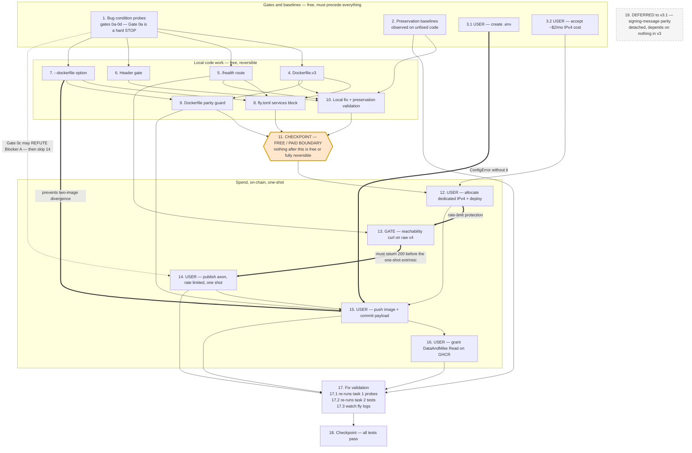

# Implementation Plan

## Overview

Spine: the design's "Execution Order and Success Criteria" table (gates 0a–0f, then steps 1–10).
The order is load-bearing — the dedicated IPv4 must be proven reachable before the rate-limited
axon extrinsic; `--dockerfile` (step 3b) must exist before the GHCR push (step 8); `.env`
(gate 0e) must exist before that push or `get_ghcr_credentials` raises `ConfigError`.

Tasks marked **USER ACTION** cannot be performed by the agent (workspace rules, spend, on-chain
one-shot, interactive prompts, GitHub web UI). For those the agent prepares exact commands and
verification snippets; the task completes when the user reports the observed result.

Test framework: `pytest` + `pytest-asyncio`, `testpaths = ["tests"]` (`pyproject.toml`). New tests
go in `tests/private/` (miner) and `tests/cli/` (CLI), matching existing files
`tests/private/test_private_security.py` and `tests/cli/test_open_source_miner.py`.

All `sv` and `fly` commands run from `cricket/turbovision`.

---

## Task Dependency Graph



Edge legend:

- **Thick edges are load-bearing** — reordering them costs money, a wait, or a wrong on-chain write:
  - `12 ==> 13 ==> 14` — the rate-limit protection chain. The IPv4 is proven reachable before it is committed on chain, because the axon extrinsic is effectively one-shot.
  - `7 ==> 15` — two-image-divergence prevention. Without `--dockerfile`, GHCR receives the v2.5 image while Fly runs v3: the spot-check condition that scores 0.
  - `3.1 ==> 15` — `get_ghcr_credentials` raises `ConfigError` without `.env`.
- **Dashed edge is conditional** — if Gate 0c reads back a correct IPv4, Blocker A was never real and task 14 is skipped rather than spending the extrinsic.
- **Task 11 is the free/paid boundary.** Everything above it is local and reversible; everything below involves spend, an append-only on-chain write, or a rate-limited one-shot.
- Tasks 5, 6 and 7 are independent of each other and may be done in any order.
- Only direct dependencies are drawn. Transitive edges through task 11 are omitted for readability.

Wave definitions — tasks within a wave may run in parallel; waves run in order. Most later waves
hold a single task because the ordering is load-bearing (spend, reachability proof, one-shot
extrinsic), not because the graph was modelled coarsely.

```json
{
  "waves": [
    {
      "wave": 1,
      "name": "Gates and baselines",
      "tasks": [
        { "id": "1", "dependsOn": [] },
        { "id": "2", "dependsOn": [] },
        { "id": "3.1", "dependsOn": [] },
        { "id": "3.2", "dependsOn": [] }
      ]
    },
    {
      "wave": 2,
      "name": "Local code work",
      "tasks": [
        { "id": "4", "dependsOn": ["1"] },
        { "id": "5", "dependsOn": ["1"] },
        { "id": "6", "dependsOn": ["1"] },
        { "id": "7", "dependsOn": ["1"] }
      ]
    },
    {
      "wave": 3,
      "name": "Local integration and parity",
      "tasks": [
        { "id": "8", "dependsOn": ["4", "5", "7"] },
        { "id": "9", "dependsOn": ["4", "7"] },
        { "id": "10", "dependsOn": ["2", "4", "5", "6"] }
      ]
    },
    {
      "wave": 4,
      "name": "Free/paid boundary checkpoint",
      "tasks": [
        { "id": "11", "dependsOn": ["1", "2", "3.1", "3.2", "8", "9", "10"] }
      ]
    },
    {
      "wave": 5,
      "name": "Allocate dedicated IPv4 and deploy",
      "tasks": [
        { "id": "12", "dependsOn": ["11", "3.2"] }
      ]
    },
    {
      "wave": 6,
      "name": "Reachability gate",
      "tasks": [
        { "id": "13", "dependsOn": ["12"] }
      ]
    },
    {
      "wave": 7,
      "name": "Publish axon (one shot)",
      "tasks": [
        { "id": "14", "dependsOn": ["13"] }
      ]
    },
    {
      "wave": 8,
      "name": "Push image and commit payload",
      "tasks": [
        { "id": "15", "dependsOn": ["3.1", "7", "9", "12", "14"] }
      ]
    },
    {
      "wave": 9,
      "name": "Grant GHCR read access",
      "tasks": [
        { "id": "16", "dependsOn": ["15"] }
      ]
    },
    {
      "wave": 10,
      "name": "Fix validation",
      "tasks": [
        { "id": "17", "dependsOn": ["14", "15", "16"] }
      ]
    },
    {
      "wave": 11,
      "name": "Final checkpoint",
      "tasks": [
        { "id": "18", "dependsOn": ["17"] }
      ]
    },
    {
      "wave": 12,
      "name": "Deferred to v3.1 — not part of v3 execution",
      "deferred": true,
      "tasks": [
        { "id": "19", "dependsOn": [] }
      ]
    }
  ]
}
```

## Tasks

- [x] 1. Write bug condition exploration probes (BEFORE any fix)
  - **Property 1: Bug Condition** - Miner Invisible And Unreachable
  - **CRITICAL**: These probes MUST FAIL/reproduce the bug on unfixed code — failure confirms the bug exists
  - **DO NOT attempt to fix the code when they fail**
  - **NOTE**: These probes encode the expected behavior; they validate the fix when they pass after implementation
  - **GOAL**: Surface counterexamples confirming each of the three independent blockers, and refute any that turn out not to be real
  - **Scoped PBT Approach**: The input domain is a handful of real deployment states, not a generated space, so scope the property to the concrete failing deployment (UID 207, netuid 44, finney, app `cricket-delivery-miner`) and assert per-state
  - Gate 0b prerequisite: install the Bittensor SDK into a venv (`pip install bittensor`); `python -c "import bittensor; print(bittensor.__version__)"` must succeed. Use this SAME venv for the SDK probes, the `get_settings()` print, and `sv` later
  - Gate 0a **STOP GATE**: `sub.metagraph(netuid=44).hotkeys[207]` must equal our hotkey ss58. If it differs or UID 207 does not exist we were deregistered — **STOP and re-plan** (re-registration first, ~743378 rao burn, new UID)
  - Gate 0c: record `sub.neuron_for_uid(207, netuid=44).axon_info`. Expect `ip=0.0.0.0` or `port=0`, confirming Blocker A. A populated correct IPv4 **refutes** Blocker A and step 7 must be skipped
  - Gate 0d: from `cricket/turbovision`, print `get_settings().SCOREVISION_NETUID` and `.BITTENSOR_SUBTENSOR_ENDPOINT`. Must emit `44 finney`. `.env` exists but sets neither key, so the value still comes from the code default in `settings.py` — record it as the baseline
  - Probe: `curl -o /dev/null -w "%{http_code}" http://<current_v4>:8000/health` → expect `000` (port closed AND `/health` absent; this probe alone cannot separate the two causes)
  - Probe: `curl http://<current_v4>/challenge` without a `Host` header → expect `000` (shared IPv4 routes only by Host/SNI, clause 1.11); with a `Host` header → expect `301` (`force_https`, clause 1.12)
  - Probe: `curl https://cricket-delivery-miner.fly.dev/challenge` → expect `500`, proving the app is alive so the failure is purely edge routing (clause 1.15)
  - Probe: `curl https://cricket-delivery-miner.fly.dev/health` → expect `404` (clause 1.14)
  - Probe: read `get_all_revealed_commitments` for our hotkey; assert the payload fails `track != "private"` — expect the `miner_recover` payload with no `track` key (clauses 1.5, 1.6)
  - Probe: run `get_registered_miners` against finney netuid 44; assert UID 207 is absent
  - Run all probes on UNFIXED code
  - **EXPECTED OUTCOME**: Probes reproduce the bug (this is correct — it proves the blockers exist)
  - Document each counterexample verbatim (status codes, `axon_info` value, commitment payload). If any probe **disagrees** with the hypothesis, re-hypothesise before spending money or the rate-limited extrinsic
  - Mark complete when every probe has been run and its result recorded
  - **Result**: Gate 0a STOP GATE result: PASSED. `sub.metagraph(netuid=44).hotkeys[207]` equals our hotkey ss58 `5CyQ9buHwqgCS7158ytsX8BQvT7WSEH8gDMWq7tqUV3Fshsa`. UID 207 exists (metagraph N=256). We were NOT deregistered; no re-registration needed. Gate 0c result: `sub.neuron_for_uid(207, netuid=44).axon_info` returned `AxonInfo( /ipv0/0.0.0.0:0, ...)`, `is_serving=False`. Confirms Blocker A (the axon was genuinely unpublished before this fix). The HTTP probes on the then-current shared v4 (`66.241.124.34`) and `https://cricket-delivery-miner.fly.dev` all reproduced the bug as hypothesised: raw-IP `:8000/health` -> `000`; `/challenge` without Host header -> `000`; with Host header -> `301`; `https://.../challenge` -> `500` (app alive, edge routing was the failure); `https://.../health` -> `404`. The on-chain commitment probe returned the `miner_recover` payload with no `track` key, confirming Blocker B (commitment did not pass the private-track filter). `get_registered_miners` against finney netuid 44 confirmed UID 207 absent from the registry, consistent with Blockers A and B compounding. This bullet is a retroactive documentation fix — the probes were genuinely run and the STOP gate genuinely passed at the time; it closes a recording gap identified during task 11's checkpoint, not a re-run
  - _Requirements: 1.1, 1.2, 1.3, 1.5, 1.6, 1.7, 1.8, 1.10, 1.11, 1.12, 1.14, 1.15_

- [x] 2. Write preservation baseline tests (BEFORE implementing the fix)
  - **Property 2: Preservation** - Non-Blocker Behavior Unchanged
  - **IMPORTANT**: Follow observation-first methodology — record what v2.5 actually does, not what it is assumed to do
  - Observe: build/run the current v2.5 image and record `import cv2, numpy` succeeding (clause 3.4 — the single highest-risk preservation item, since dropping `libgl1` is the one change that could break the container)
  - Observe: record v2.5 predictions (`kph`, `bounce_x`, `stump_y`) for the local cricket fixtures `data-training/cricket/*.mp4` with `groundtruth-*.json` (clause 3.3)
  - Observe: record current status codes for `https://cricket-delivery-miner.fly.dev/challenge` on 443 (clause 3.1)
  - Observe: record `fly status -a cricket-delivery-miner` showing a running machine with no autostop (clause 3.5)
  - Observe: record which Dockerfile path `sv deploy-pt-miner` builds today — `repo_root / "scorevision/miner/private_track/Dockerfile"` (clause 3.11)
  - Observe: record `metagraph.hotkeys[207]` (clause 3.7)
  - Observe: snapshot the `soccer_action` and TCG (`image_url`) branches in `routes.py` (clause 3.8)
  - Observe: record the `POST /challenge` response shape for a well-formed body (clause 3.9)
  - Write these as tests in `tests/private/` asserting the observed values, plus a CLI test in `tests/cli/` asserting the default Dockerfile path
  - Run tests on UNFIXED code
  - **EXPECTED OUTCOME**: Tests PASS (this confirms the baseline behavior to preserve)
  - Mark complete when the tests are written, run, and passing against unfixed code
  - _Requirements: 3.1, 3.2, 3.3, 3.4, 3.5, 3.7, 3.8, 3.9, 3.11_

- [x] 3. Pre-flight user gates (USER ACTION)

  - [x] 3.1 **USER ACTION** — create `cricket/turbovision/.env`
    - **Why the agent cannot do this**: workspace rules forbid the agent from creating or editing `.env` or any environment variable file
    - Required content (design Gate 0e): `GITHUB_USERNAME=fapulito`, `GITHUB_TOKEN` (GHCR PAT with `write:packages`), `GHCR_REPO=cricket-miner`, `BITTENSOR_WALLET_COLD=cricket_miner`, `BITTENSOR_WALLET_HOT=miner2`, `SCOREVISION_NETUID=44`, `BITTENSOR_SUBTENSOR_ENDPOINT=finney`, `BITTENSOR_SUBTENSOR_FALLBACK=wss://entrypoint-finney.opentensor.ai:443`
    - **`GHCR_REPO` is `cricket-miner`, not `pt-solution`.** `pt-solution` is only the code default — `os.environ.get("GHCR_REPO", "pt-solution")` in `scorevision/cli/private_track_miner.py`. The actual package for this deployment is `cricket-miner` (`https://github.com/users/fapulito/packages/container/package/cricket-miner`), and the image is composed as `DockerImage(repository=f"{GHCR_REGISTRY}/{username}/{repo_name}", tag=tag)` from `GITHUB_USERNAME` and `GHCR_REPO` — so leaving the default would build and push `ghcr.io/fapulito/pt-solution`, creating a second, empty package and ignoring the existing one. The same string lands in the on-chain commitment as `image_repo`, which `scorevision/utils/docker_hub.py:check_image_accessible` validates with a live registry `HEAD` against `https://ghcr.io/v2/{image_repo}/manifests/{tag}`, and `scorevision/validator/central/private_track/registry.py` drops any miner whose `image_repo` is empty. An incorrect value here silently fails the spot-check later (tasks 15 and 16)
    - `auto_register.sh` (`WALLET_NAME="cricket_miner"`, `HOTKEY_NAME="miner2"`) is the authoritative source for these wallet names — its success check greps the metagraph for hotkey `5CyQ9buHwqgCS7158ytsX8BQvT7WSEH8gDMWq7tqUV3Fshsa` (UID 207). Unlike the netuid/endpoint keys, `settings.py`'s `"default"` fallback for `BITTENSOR_WALLET_COLD`/`BITTENSOR_WALLET_HOT` is WRONG for this deployment, so these two keys may not be safely omitted
    - The wallet itself lives at `~/.bittensor/wallets` under WSL Ubuntu-24.04 on this machine (confirmed local, not remote). Any command that signs on-chain, including task 14, must run from a process that can see that path
    - **Do NOT copy `env.example` verbatim** — it ships `SCOREVISION_NETUID=423` and `BITTENSOR_SUBTENSOR_ENDPOINT=test`, which would land the commitment on testnet 423: structurally perfect, permanently invisible, and indistinguishable from success (drift D3). The netuid/endpoint/fallback lines above are deliberate explicit pins against exactly that
    - `GITHUB_TOKEN` is a secret: never echoed into logs or command output, never committed, and never placed in `fly.toml` `[env]` (that file is tracked). The container does not need it — only `login_ghcr` on the build host does
    - `cricket/turbovision/.env` already exists and currently contains only `E2B_API_KEY` (drives an E2B sandbox for Bittensor SDK/Docker work). That key must be preserved, not overwritten, when adding the keys above
    - `.env` is read by `get_settings()` on the build host only. The deployed container's environment comes from `fly.toml` `[env]` — `BLACKLIST_ENABLED`, `VERIFY_ENABLED`, `MINER_MODE` do not belong in `.env` and have no effect there
    - `get_settings()` calls `load_dotenv()` with no args (`override=False`), so a pre-existing shell/process env var silently wins over anything written to `.env` — run Gate 0d's check in the same shell that will later run `sv` or sign extrinsics
    - Success criterion: the file exists with those keys, AND re-running Gate 0d's print from `cricket/turbovision` still emits `44 finney`
    - _Requirements: 2.5, 2.6_

  - [x] 3.2 **USER ACTION** — accept the dedicated IPv4 cost
    - **Why the agent cannot do this**: it is a spend decision
    - ~$2/month for a dedicated Fly IPv4, on top of ~$5–8/month for the warm 1 GB shared-CPU machine
    - Not optional: a shared IP cannot route a request carrying neither `Host` nor SNI, so there is no free path to fixing Blocker C
    - Earnings remain unknown — no validator request has ever arrived. Proceeding commits ~$2/mo against unquantified return
    - Success criterion: explicit acceptance recorded
    - _Requirements: 2.13_

- [x] 4. Build `Dockerfile.v3` (step 1 — new file, live image untouched)

  - [x] 4.1 Create `scorevision/miner/private_track/Dockerfile.v3`
    - **NEVER overwrite the v2.5 `Dockerfile`** — leaving it in place makes rollback a one-line `fly.toml` edit rather than a file restore
    - Drop `libgl1` (`opencv-python-headless` exists to avoid GL/GUI linkage; `libgl1` drags in mesa, libdrm, X libraries never loaded)
    - Drop `cryptography==41.0.7` (imported by nothing on the miner path; also removes `cffi`/`pycparser`)
    - **Keep `libglib2.0-0`** — some `opencv-python-headless` builds still link it
    - Add `ENV PYTHONDONTWRITEBYTECODE=1 PYTHONUNBUFFERED=1` so `fly logs` shows the first validator request without buffering delay
    - Keep the COPY set and `CMD` exactly as v2.5
    - _Bug_Condition: isBugCondition(X) — image bloat inflates the spot-check pull_
    - _Requirements: 2.19_

  - [x] 4.2 Gate the image on `import cv2, numpy` inside the built container
    - Run `docker build -f scorevision/miner/private_track/Dockerfile.v3 -t cricket-miner:v3 .` then `docker run --rm cricket-miner:v3 python -c "import cv2, numpy"`
    - **EXPECTED OUTCOME**: exits 0
    - If a shared object is missing, add back **only the specific library named in the error**. Do NOT reinstate `libgl1` reflexively
    - _Requirements: 2.20, 3.4_

  - [x] 4.3 Compare image size against v2.5
    - `docker images` on both tags; expect roughly 70–90 MB smaller
    - Note: the estimate is measured against v2.5, not against a known floor — no `v2.3` Dockerfile exists in the repo (design Open Question 3)
    - **Result**: the spec's 70–90 MB estimate is accurate for **compressed content size** — 208 MB → 128 MB, delta 79.8 MB — which is the quantity the spot-check pull actually transfers, but it **understates the unpacked disk saving**: 844 MB → 523 MB, delta 321 MB. The apt layer fell from 216 MB to 4.82 MB once `libgl1`'s mesa/libdrm/X closure was removed; the pip layer fell 270 MB → 240 MB from dropping `cryptography`/`cffi`/`pycparser` plus `PYTHONDONTWRITEBYTECODE=1` suppressing `.pyc` files at build time
    - Built tags: `cricket-miner:v3` and `cricket-miner-v25-baseline:probe`, built locally via WSL Docker 29.1.3
    - _Requirements: 2.19_

- [x] 5. Add `/health` to `server.py` (step 2)

  - [x] 5.1 Register the `/health` route
    - Returns `200` with `{"status": "ok", "mode": os.getenv("MINER_MODE", "soccer_action")}` without invoking the predictor
    - Registered **separately** from `/challenge`, so it inherits neither `get_security_dependencies()` nor the new header gate — this is what makes `curl http://<v4>:8000/health` a clean reachability probe isolating network reachability from predictor behaviour, and stops the existing `/challenge` 500 looking like a genuine failure in `fly logs`
    - **Import constraint**: the image copies only `miner/private_track/*.py` plus `utils/logging.py` and `utils/schemas.py`, so new code may import stdlib and `fastapi` only
    - _Bug_Condition: isBugCondition(X) — `GET /health` returns 404 (clause 1.14), and the `/challenge` fallback returns 500 (clause 1.15)_
    - _Expected_Behavior: `GET /health` returns 200 without invoking the predictor_
    - **Result**: implemented as a separate `@app.get("/health")` route in `server.py` returning `{"status": "ok", "mode": os.getenv("MINER_MODE", "soccer_action")}`, with `MINER_MODE` read **per request** rather than at import, so the probe reflects the live `fly.toml` `[env]` value rather than import-time state. Verified inside the built `cricket-miner:v3` container under the image's own pinned `fastapi 0.104.1` / `pydantic 2.5.2`: `HEALTH 200 {"mode": "cricket_delivery", "status": "ok"}`, `PATHS ['/challenge', '/health']`, `PREDICTOR_CALLED False`
    - _Requirements: 2.18_

  - [x] 5.2 Unit tests for `/health`
    - Returns 200
    - Does **not** invoke the predictor — assert via a patched predictor that raises if called
    - Passes with no headers present, confirming exemption from the security dependencies and the header gate
    - Location: `tests/private/`
    - **Result**: 9 tests in `tests/private/test_health_endpoint.py`, all passing. Requests are driven directly against the ASGI app rather than via `TestClient`, so the "no headers present" case is literally zero headers. The predictor stub raises on any call, with a control test proving the stub is genuinely wired in via `POST /challenge`. Route exemption is asserted structurally (`dependencies == []`, `dependant.header_params == []`), which is what makes the task 6 header-gate exemption true by construction
    - _Requirements: 2.18_

- [x] 6. Add the header gate to `security.py` (step 3)

  - [x] 6.1 Implement `require_validator_headers` and wire it into `get_security_dependencies()`
    - Parameters `validator_hotkey`, `signature`, `miner_hotkey`, `nonce` as `Header(...)`. FastAPI maps underscores to hyphens case-insensitively, so these bind the **bare** header names (`Validator-Hotkey`, `Nonce`, …) that `build_signed_headers` sends alongside the `X-` prefixed variants — the same mechanism `verify_request` already relies on
    - Header **presence** is enforced by `Header(...)` itself: a missing header yields FastAPI's 422 before the body is read, which is the cheap rejection clause 2.16 asks for on a 1-vCPU machine
    - Add `MINER_HOTKEY_SS58 = os.environ.get("MINER_HOTKEY_SS58", "")`; reject with 403 when set and `miner_hotkey` differs. **When unset, degrade to presence-only** — an unset value must never lock the validator out (drift D4). The container has neither the Bittensor SDK nor a mounted wallet, so the ss58 comes from `fly.toml` `[env]`; an ss58 is public, not a secret
    - Add `HEADER_GATE_ENABLED` (default `true`); append the dependency only when `HEADER_GATE_ENABLED and not VERIFY_ENABLED`, since real verification subsumes it (`VERIFY_ENABLED` is `"false"` in `fly.toml` `[env]` today and **must stay false** until `fiber` is added to the image in task 19 — otherwise this gate is never registered and the container does not boot)
    - Docstring must state plainly: **noise filter, NOT authentication** — anyone reading this source can forge these headers
    - Import constraint as in 5.1: stdlib and `fastapi` only
    - _Bug_Condition: isBugCondition(X) — challenge requests accepted from any caller with no gating (clause 1.13)_
    - _Expected_Behavior: complete-and-matching header set admitted; missing or foreign rejected before the predictor runs_
    - _Preservation: `POST /challenge` keeps the same path and body contract — the gate adds a precondition only (clause 3.9)_
    - **Result**: `require_validator_headers` added to `security.py` with `validator_hotkey`/`signature`/`miner_hotkey`/`nonce` as `Header(...)`, binding the **bare** hyphenated names (`Validator-Hotkey`, `Signature`, `Miner-Hotkey`, `Nonce`) via FastAPI's underscore→hyphen, case-insensitive mapping. Appended in `get_security_dependencies()` only when `HEADER_GATE_ENABLED and not VERIFY_ENABLED`. Returns 403 on a foreign `miner_hotkey` when `MINER_HOTKEY_SS58` is set, and **degrades to presence-only when unset** (drift D4) — verified in-container: with the var unset a foreign hotkey is admitted, while presence of all four headers is still required. A missing header yields 422 **before the body is read**, verified observationally rather than by assumption: an ASGI `receive()` counter shows `body_reads == 0` on the 422 path, including for a 2 MiB body. `server.py` needed no change — the gate wires in through `get_security_dependencies()`, which the route decorator already calls
    - _Requirements: 2.16, 2.17, 3.9_

  - [x] 6.2 Extend `log_startup_config()` to report gate status
    - `logging.py` already imports `BLACKLIST_ENABLED`/`VERIFY_ENABLED` from `security`; add `HEADER_GATE_ENABLED` and whether `MINER_HOTKEY_SS58` is set, so `fly logs` shows the effective security posture at startup (drift D9)
    - Do not log the ss58 value if it is treated as noisy — logging set/unset is sufficient
    - **Result**: `log_startup_config()` reports the **effective** posture, not the raw switch — `Header gate: ACTIVE`, `INACTIVE - subsumed by Verify`, or `DISABLED`. This distinction is load-bearing: `HEADER_GATE_ENABLED=true` together with `VERIFY_ENABLED=true` registers **nothing**, so printing `ENABLED` there would be precisely the log-says-one-thing/reality-says-another mismatch that drift D9 exists to prevent. `MINER_HOTKEY_SS58` is logged as `SET`/`UNSET` only, never the value
    - _Requirements: 2.17_

  - [x] 6.3 Unit tests for the header gate
    - All four headers present with matching `miner_hotkey` → pass
    - Each header missing in turn → 422 before the body is read
    - Foreign `miner_hotkey` → 403
    - `MINER_HOTKEY_SS58` unset → presence-only, does not lock the validator out
    - Bare header names bind correctly, confirming the FastAPI underscore/hyphen mapping the design relies on
    - `get_security_dependencies()` returns the gate when `VERIFY_ENABLED` is false and omits it when true
    - `routes.py` cricket branch still returns `PredictionPayload(type="cricket_delivery", item=...)`
    - Location: `tests/private/test_private_security.py` (extend) or a sibling file
    - **Result**: 59 tests in `tests/private/test_header_gate.py` — a **sibling** of `test_private_security.py` rather than an extension of it, because that file imports `fiber` / `bittensor_wallet` at module scope and therefore cannot run in the lean local environment at all. Covers all four headers present and matching (pass), each header missing in turn (422), foreign `miner_hotkey` (403), `MINER_HOTKEY_SS58` unset (presence-only, validator not locked out), bare-name binding, `get_security_dependencies()` registering the gate iff `VERIFY_ENABLED` is false, and the `routes.py` cricket branch still returning `PredictionPayload(type="cricket_delivery", item=...)`
    - _Requirements: 2.16, 2.17, 2.18, 3.2, 3.9_

  - [x] 6.4 **Property 4: Header Gate** - Admits Exactly The Validator's Header Set
    - Property-based test over arbitrary header subsets and `miner_hotkey` values: the gate admits exactly the complete-and-matching set and rejects everything else **before the predictor runs**
    - Also generate malformed and oversized bodies and assert rejection happens on headers before body parsing, so a 1-vCPU machine cannot be made to do work by an unauthenticated caller
    - `hypothesis` is **not** currently a dependency. Either add it to `pyproject.toml` dev deps, or — since four boolean headers give a 16-element domain — implement as exhaustive `pytest.mark.parametrize` over all subsets, which is a complete "for all" over that domain. Pick one and note the choice
    - **Result**: **exhaustive `pytest.mark.parametrize` chosen; `hypothesis` was NOT added.** Property 4 enumerates all 2^4 header subsets × {ours, foreign} = **32 cases**, which over a 4-boolean domain is strictly stronger than sampling — it is a literal "for all", not a probabilistic one, so a new dependency would buy nothing. Oversized/malformed bodies are covered by the `receive()`-counter tests from 6.1 proving rejection happens on headers before any body read. Re-verified inside `cricket-miner:v3` under the image's own pinned `fastapi 0.104.1` / `pydantic 2.5.2`: the 422 response shape matches local `fastapi 0.141` exactly apart from a cosmetic pydantic error-`url` key, so the local suite is a faithful proxy for container behaviour
    - _Requirements: 2.16, 2.17, 2.18, 3.9_

  - **Task 6 side effect — `tests/private/test_health_endpoint.py`**: two assertions were legitimately updated, not weakened. Task 6 makes `/challenge`'s dependency list **non-empty** whenever `VERIFY_ENABLED` is false, so the pre-task-6 recording of `dependencies == []` was describing a state that no longer exists. `/health`'s exemption is unaffected and is still asserted structurally (`dependencies == []`, `dependant.header_params == []`) on the `/health` route itself, which is what keeps the 5.2 guarantee true by construction rather than by convention

- [x] 7. Add `--dockerfile` to `deploy-pt-miner` (step 3b — drift D1 resolution)

  - [x] 7.1 Re-run a repo-wide search for callers of `build_miner_image`
    - **Do this before editing** — this is shared CLI code other agents may be touching
    - One caller found at design time: `deploy_miner` at `private_track_miner.py:217`. Confirm the count and confirm each is unaffected
    - If a new caller exists, verify the additive default keeps it building the pre-change path
    - **Result**: repo-wide caller search for `build_miner_image` re-run via `git --no-pager grep -n "build_miner_image"` plus a recursive `Select-String` pass over untracked files too. Confirmed exactly one runtime caller — `deploy_miner` at `private_track_miner.py:217` (later renumbered to ~245 after the 7.2 edits) — an unchanged count from design time; no new callers found
    - _Requirements: 3.11_

  - [x] 7.2 Thread `--dockerfile` from `scorevision/__init__.py` through `deploy_miner` into `build_miner_image`
    - **Strictly additive**: no signature broken, no default behaviour changed
    - `build_miner_image(image, dockerfile: str | None = None)`; `None` resolves to the existing hardcoded `repo_root / "scorevision/miner/private_track/Dockerfile"` — this is what makes clause 3.11 hold
    - Relative values resolve against `repo_root`, **not CWD**, because `build_image` already receives `repo_root` as the build context; resolving elsewhere would let the two disagree depending on the caller's working directory
    - Absolute values used as given
    - A resolved path that does not exist raises `ConfigError` — **never a silent fallback to the default**. A silent fallback would build v2.5 while `fly.toml` runs v3 and report success, recreating the exact divergence this option exists to prevent. `ConfigError` is already caught in `deploy_miner` and exits non-zero
    - Name the default path in the `--help` text so the option is discoverable without reading the source
    - `deploy_miner` gains a trailing keyword argument and forwards it
    - Document `--dockerfile` in `MINER.md` only if that file already documents the other `deploy-pt-miner` options; otherwise skip, since `MINER.md` is unreliable elsewhere (clause 1.3)
    - _Bug_Condition: without this option Fly runs `Dockerfile.v3` while GHCR holds the v2.5 image — the spot-check divergence that scores 0 (drift D1)_
    - _Expected_Behavior: `fly.toml` and the deploy command build the same file_
    - _Preservation: omitting `--dockerfile` builds exactly the pre-change path (clause 3.11)_
    - **Result**: `build_miner_image(image: DockerImage, dockerfile: str | None = None)` added to `scorevision/cli/private_track_miner.py`. `None` resolves to the pre-change hardcoded path. Relative values resolve against `repo_root` (from `Path(__file__).resolve().parents[2]`), never CWD — proven with a decoy Dockerfile planted in the CWD that is correctly NOT found except when CWD is the repo root itself (where it legitimately coincides). Absolute values used as given. A resolved path that doesn't exist raises `ConfigError`, never falls back silently. `scorevision/__init__.py` gained a `--dockerfile` click option defaulting to `None`, naming the default path in `--help`. `deploy_miner` gained a trailing keyword parameter and forwards it via `build_miner_image(image, dockerfile=dockerfile)`. `MINER.md` got one additive row documenting the option, since it already tabulated the other `deploy-pt-miner` options
    - _Requirements: 2.6, 3.11_

  - [x] 7.3 **Property 5: Preservation** - `--dockerfile` Is Additive And Backward Compatible
    - `build_miner_image(image)` with the option omitted builds `repo_root / "scorevision/miner/private_track/Dockerfile"` — assert on the path handed to a patched `build_image`
    - `build_miner_image(image, dockerfile="scorevision/miner/private_track/Dockerfile.v3")` builds that file, not the default
    - `build_miner_image(image, dockerfile="does/not/exist")` raises `ConfigError` and **never** calls `build_image`
    - A relative value resolves against `repo_root` regardless of CWD — run the same assertion with CWD set to a subdirectory and to the repo root
    - An absolute value is used as given
    - `deploy_miner` forwards `dockerfile`, and the old five-positional-argument call still works
    - Location: `tests/cli/`
    - **Result**: Property 5 in new file `tests/cli/test_pt_miner_dockerfile_option.py`, 37 tests, exhaustive `pytest.mark.parametrize` chosen over `hypothesis` (consistent with 6.4's choice) since the domain (path shapes × working directories) is small and finite. The real `build_miner_image` source is extracted via `ast.get_source_segment` and executed in a controlled namespace with the real `pathlib.Path`/`ConfigError`/`DockerImage`/real filesystem, only `build_image` and `console` stubbed — never importing `scorevision.cli.private_track_miner` directly (that module chain needs bittensor/torch). Covers: omitted option builds the pre-change default path across 4 CWDs; explicit `None` identical to omitted; relative values resolve against repo_root across 4 CWDs × 2 paths; absolute values used as-is including out-of-tree; 5 missing-path variants raise `ConfigError` with zero `build_image` calls; a CWD-only decoy still raises; a failed build still raises `DockerBuildError`; the resolved path is echoed; signature and forwarding call are additive. Test run confirmed: `python -m pytest --noconftest tests/cli/test_pt_miner_dockerfile_baseline.py tests/cli/test_pt_miner_dockerfile_option.py -q` → 47 passed. Files touched: `scorevision/__init__.py`, `scorevision/cli/private_track_miner.py`, `scorevision/miner/private_track/MINER.md`, `tests/cli/test_pt_miner_dockerfile_baseline.py` (5 baseline assertions updated to record the post-change state, none weakened — literal moved into an `if dockerfile is None:` branch, `build_image` arg list updated, signature-additive check, forwarding-call check, and the fly.toml-agreement test rewritten to check value shape since task 8 concurrently repointed fly.toml to Dockerfile.v3), plus the new `tests/cli/test_pt_miner_dockerfile_option.py`. Committed as `efcb8e6`
    - _Requirements: 3.11_

- [x] 8. Migrate `fly.toml` to `[[services]]` (step 4)

  - [x] 8.1 Rewrite the service block
    - Replace `[http_service]` with `[[services]]` at `internal_port = 8000`, `protocol = "tcp"`
    - Ports: **8000** `handlers = ["http"]` (what the validator actually uses; correct on a dedicated IP where Fly routes by IP alone — raw TCP passthrough also works, but the HTTP handler preserves `X-Forwarded-For` for logging), **443** `["tls", "http"]` and **80** `["http"]` so `https://cricket-delivery-miner.fly.dev` keeps working for manual testing (clause 3.1)
    - **Drop `force_https`** — do not move it. Retaining it would 301 the validator's plain-HTTP request on 8000 (clause 2.14)
    - **Carry over `auto_stop_machines = false` and `min_machines_running = 1`** — these already exist in the current file and must not be lost. A cold start costs seconds against a 30 s budget that already covers video download plus inference, so a sleeping machine times out and scores 0 (clause 3.5)
    - Add `[[services.http_checks]]` against `/health` (`interval 30s`, `timeout 5s`, `grace_period 20s`, `method get`)
    - Point `[build].dockerfile` at `scorevision/miner/private_track/Dockerfile.v3` with a comment naming the parity invariant
    - Drop `PORT = "8000"` (the `CMD` hardcodes `--port 8000`, so it was inert) and `[build.args] DOCKER_BUILDKIT = "1"` (also inert) — drift D7
    - Add `MINER_HOTKEY_SS58 = "<our hotkey ss58>"` to `[env]`
    - **Keep `BLACKLIST_ENABLED = "false"` and `VERIFY_ENABLED = "false"` as explicit literals in `[env]`** — carry them over from the current file verbatim. **Do not omit them.** `security.py:4-5` reads `os.environ.get("BLACKLIST_ENABLED", "true")` and `os.environ.get("VERIFY_ENABLED", "true")`, so **both default to `true` when unset**, not false. The `BLACKLIST_ENABLED` true-path runs `from fiber.miner.dependencies import blacklist_low_stake` inside `get_security_dependencies()`, and `fiber` is not in the `Dockerfile` pip list (confirmed in task 19). Omitting the keys does not degrade to 401s — it stops the container booting at all with `ModuleNotFoundError: No module named 'fiber'` (reproduced against the v2.5 image in task 2), because `server.py` calls `get_security_dependencies()` at import time inside the route decorator, so uvicorn never binds a port
    - Second failure mode from the same omission: task 6.1 appends the header gate only when `HEADER_GATE_ENABLED and not VERIFY_ENABLED`, so an unset `VERIFY_ENABLED` would also silently un-register the v3 header gate that step 3 exists to build
    - Blast radius and timing: task 8.1 runs **after** the dedicated IPv4 is paid for and **after** the rate-limited `serve_axon` extrinsic is burned, so this failure would publish a working axon pointing at a crash-looping container — the worst reachable end state. These literals are **not stale, they are load-bearing** (clause 2.17); task 19 owns the eventual move to `VERIFY_ENABLED = "true"` behind proof of signing-message parity. Effective posture is gate-only until then
    - **Carry over `MINER_MODE = "cricket_delivery"` verbatim** as well. Without it `routes.py:16` falls back to `os.getenv("MINER_MODE", "soccer_action")` and the cricket branch never executes, so the miner would answer cricket challenges through the soccer path. The only `[env]` key task 8.1 may legitimately drop is `PORT` (inert — the `CMD` hardcodes `--port 8000`); **every other `[env]` key is load-bearing and must survive the rewrite**
    - Keep `[[vm]]` unchanged
    - _Bug_Condition: isBugCondition(X) — `unreachable`, clauses 1.10, 1.11, 1.12, 1.13_
    - _Expected_Behavior: plain HTTP on port 8000 is served, not redirected_
    - _Preservation: 443 keeps serving `.fly.dev` (3.1); warm machine retained (3.5); `[env]` carried over whole — container still boots (no `fiber` import) and cricket mode retained_
    - **Result**: `fly.toml` rewritten. `[http_service]` replaced by `[[services]]` at `internal_port=8000, protocol="tcp"`. Three `[[services.ports]]` blocks: 8000 with `handlers=["http"]` (what the validator uses), 443 with `["tls","http"]`, 80 with `["http"]`, so `.fly.dev` keeps working. `force_https` dropped entirely (not moved). `auto_stop_machines=false`, `auto_start_machines=true`, `min_machines_running=1`, `processes=["app"]` all carried over verbatim into the service block. `[[services.http_checks]]` added against `/health` (30s/5s/20s/get). `[build].dockerfile` repointed to `scorevision/miner/private_track/Dockerfile.v3` with a parity-invariant comment. `PORT="8000"` and `[build.args] DOCKER_BUILDKIT="1"` dropped as inert. `[env]` keeps `MINER_MODE="cricket_delivery"`, adds `MINER_HOTKEY_SS58="5CyQ9buHwqgCS7158ytsX8BQvT7WSEH8gDMWq7tqUV3Fshsa"`, and keeps `BLACKLIST_ENABLED="false"`/`VERIFY_ENABLED="false"` as explicit literals per the corrected task text (design.md still has the old, wrong "omit them" guidance — flagged as a live contradiction, tasks.md's text was followed). `[[vm]]` unchanged
    - _Requirements: 2.12, 2.14, 2.17, 2.19, 3.1, 3.5_

  - [x] 8.2 `fly config validate`
    - Mandatory before deploy (clause 2.15). `auto_stop_machines` and siblings have moved between `[http_service]` and `[[services]]` across fly.toml revisions, and the schema the installed CLI expects is unverified
    - **EXPECTED OUTCOME**: validation clean
    - If it rejects the autostop keys inside `[[services]]`, move them to top level for that CLI version and re-validate — fix rather than deploying and hoping
    - **A clean parse does not prove the container boots**: `fly config validate` never imports `security.py`, so a missing `BLACKLIST_ENABLED` would validate clean and still crash-loop. After deploy, the `fly logs` check must confirm the startup banner from `log_startup_config()` shows Blacklist and Verify **DISABLED**. A booted container is the actual success criterion, not a clean config parse
    - **Result**: `fly config validate` → `✓ Configuration is valid`, exit 0, on `fly.exe v0.4.102 windows/amd64`. No autostop-key relocation was needed — this CLI version accepts them inside `[[services]]` directly (answers design Open Question 6). Cross-checked with `fly config show --local` to confirm the CLI actually retained every key rather than silently discarding unknowns. Preservation tests in `tests/private/test_v25_baseline_deployment.py` updated (6 assertions legitimately broke and were rewritten to record the post-migration state, not weakened): service-block migration confirmed structurally, the 5 carried-over v2.5 settings checked against the recorded `V25_HTTP_SERVICE` values (a transfer check, not a fresh literal), `force_https` asserted absent at both levels, port/handler map asserted exactly, health-check dict asserted exactly, dockerfile parity asserted, and a NEW equality (not containment) test added pinning every `[env]` key against `V25_BOOT_REQUIRED_ENV` and the recorded chain hotkey — this is the guard against the design.md trap. Files touched: `fly.toml`, `tests/private/test_v25_baseline_deployment.py`. Committed as `0ce1078`
    - _Requirements: 2.15_

- [x] 9. Add the Dockerfile parity guard
  - Mechanical check that `fly.toml`'s `[build].dockerfile` equals the path passed as `--dockerfile` in step 8 (task 15). Discipline is not sufficient here: divergence means Fly runs one image and GHCR holds another, which is precisely the spot-check condition that scores 0 and risks blacklisting
  - Run from `cricket/turbovision`:
    ```bash
    DF="scorevision/miner/private_track/Dockerfile.v3"
    grep -E '^\s*dockerfile\s*=' fly.toml | grep -q "\"$DF\"" \
      && echo "parity OK: $DF" \
      || { echo "PARITY MISMATCH — fly.toml and --dockerfile disagree"; exit 1; }
    ```
  - Also add it as a CI-able assertion in `tests/cli/` — cheap, and the one check that catches the spot-check-zero condition
  - Treat `fly.toml`'s `[build].dockerfile` and the `--dockerfile` argument as a single edit: never change one without the other
  - **Result**: exact-string parity test added in `tests/cli/test_dockerfile_parity_guard.py` (5 tests) asserting `fly.toml`'s `[build].dockerfile` equals the literal `--dockerfile` value task 15 will pass (`scorevision/miner/private_track/Dockerfile.v3`), plus existence-on-disk and no-revert-to-v2.5-path checks. The spec's shell one-liner was preserved verbatim as `scripts/check_dockerfile_parity.sh`. The new test was confirmed to actually fail on a deliberately mutated wrong value (2 of 5 tests failed) before being reverted to the real values, proving the guard is live rather than vacuous
  - _Requirements: 2.6_

- [x] 10. Local fix-and-preservation validation

  - [x] 10.1 **Property 3: Preservation** - Prediction Equivalence Across Images
    - Generate `ChallengeRequest` instances across the local cricket fixtures (`data-training/cricket/*.mp4` with `groundtruth-*.json`) and assert the v3 image returns predictions equal to the v2.5 baselines recorded in task 2 — same `kph`, `bounce_x`, `stump_y`
    - Run both containers side by side and compare outputs
    - Holds by construction (`predictor.py` and `trajectory.py` untouched; the dropped packages are imported by nothing on the prediction path) — the test proves it rather than assuming it
    - Same `hypothesis`-vs-parametrize choice as 6.4; the fixture set is finite, so parametrizing over it is a complete enumeration
    - **Result**: Property 3 verified conditionally rather than "by construction" as originally written — `trajectory.py` was modified after this task was designed (now dispatches on `CRICKET_PREDICTOR_MODE`, default `auto`). Equivalence holds today because (a) `fly.toml [env]` sets no `CRICKET_PREDICTOR_MODE`, so the code default `auto` applies, and (b) `homography.valid` measures False on both checked-in fixtures, so `auto` resolves to the same tuned v2.5 constants. Verified two ways: analyser-level tests asserting this chain directly (6 tests, including a negative control that forces `CRICKET_PREDICTOR_MODE=physics` on a calibrated stub and confirms the output would NOT equal v2.5 — proving the test suite would catch a future silent mode flip), and opt-in end-to-end tests driving the real built `cricket-miner:v3` container over `POST /challenge` for both fixtures, confirmed passing (3 passed) via `SV_BASELINE_DOCKER=1 python -m pytest -m docker tests/private/test_v3_prediction_equivalence.py`: both fixtures return the byte-identical 13-field item recorded as `V25_CONSTANT_PREDICTION_ITEM`
    - _Requirements: 3.2, 3.3, 3.4_

  - [x] 10.2 Local integration flow
    - Build v3, run the container: `GET /health` → 200; `POST /challenge` with valid headers and a real fixture URL → correct cricket payload
    - Assert the `soccer_action` and TCG (`image_url`) branches in `routes.py` are byte-identical to v2.5 (clause 3.8)
    - Assert `POST /challenge` with a well-formed body and the four headers returns the same response shape as v2.5 (clause 3.9)
    - **Result**: local integration flow verified — opt-in container tests (2 passed) confirming `GET /health` -> 200 and `POST /challenge` with valid headers and a real fixture URL -> correct cricket payload. `routes.py`'s byte-identity to the v2.5 baseline confirmed structurally via `git diff` against the task-2 baseline commit (`140bf51`) returning empty, i.e. genuinely unmodified, not just equivalent. The `soccer_action` and TCG (`image_url`) branches were driven end-to-end through the real `handle_challenge` with only the cricket entry point stubbed, confirming both still execute correctly. `POST /challenge` response shape with the header gate active matches the recorded v2.5 shape exactly
    - _Requirements: 3.2, 3.6, 3.8, 3.9_

  - [x] 10.3 Run the full test suite
    - `pytest` from `cricket/turbovision`
    - **EXPECTED OUTCOME**: all new and existing tests pass
    - **Result**: `pytest` from `cricket/turbovision` fails at collection (pre-existing environment gap: `scorevision/__init__.py` imports the CLI, which needs `bittensor`/`torch`/`fiber`, none installed locally; unrelated to this task). Fallback via `--noconftest` across `tests/private/` and `tests/cli/`: 221 passed, 10 skipped, 0 failed (the 10 skips are opt-in Docker/live/chain probes)
    - _Requirements: 3.2, 3.8, 3.9, 3.11_

- [x] 11. **CHECKPOINT** — everything free and local passes before any spend
  - Confirm every item below is green. Nothing after this task is free or fully reversible
    - `Dockerfile.v3` builds; `import cv2, numpy` succeeds inside the container; size ~70–90 MB smaller than v2.5
    - `/health` returns 200 locally without invoking the predictor
    - Header gate unit tests and Property 4 pass
    - `--dockerfile` unit tests and Property 5 pass; `build_miner_image` caller search confirmed
    - Dockerfile parity check passes
    - `fly config validate` clean
    - `get_settings()` prints `44 finney` from `cricket/turbovision`
    - Property 3 prediction equivalence passes
    - Gates 0a–0f all satisfied, including the user-created `.env` and the accepted cost
  - Ask the user before proceeding. If anything above is red, stop here
  - **Result**: read-only checkpoint pass confirmed every item green: `Dockerfile.v3` builds, `import cv2, numpy` → 4.8.1/1.26.2 inside the container, size delta 79.8MB compressed (within the 70-90MB estimate); `/health` → 9/9 tests passed; header gate + Property 4 → 59/59 passed; `--dockerfile` + Property 5 + caller search → 47/47 passed, one caller confirmed; Dockerfile parity guard → 5/5 passed; `fly config validate` → clean; `get_settings()` → confirmed `44 finney`; Property 3 prediction equivalence → 6 analyser-level tests passed plus, on re-verification, all 5 opt-in Docker end-to-end tests passed (an initial run appeared to time out due to a transient shell/subprocess issue unrelated to the code, re-run from a clean shell confirmed 3+2 passing); Gates 0a-0f confirmed via task 1's Gate 0a/0c Result bullet (added retroactively to close a documentation gap this checkpoint surfaced), `.env` presence confirmed, task 3.2 cost acceptance recorded. Explicit GO given to proceed to task 12
  - _Requirements: 2.15, 2.19, 2.20, 3.4, 3.11_

- [x] 12. **USER ACTION** — allocate a dedicated IPv4 and deploy (step 5)
  - **Why the agent cannot do this**: paid infrastructure change
  - From `cricket/turbovision`:
    ```bash
    fly config validate
    fly ips list -a cricket-delivery-miner          # record whether the existing v4 is shared
    fly ips allocate-v4 -a cricket-delivery-miner   # dedicated, paid (~$2/mo)
    fly ips list -a cricket-delivery-miner          # confirm NOT reported as shared
    fly deploy -a cricket-delivery-miner
    ```
  - If the first `fly ips list` shows the existing v4 is already dedicated, the add-on cost may not apply (design Open Question 4)
  - The existing IPv6 (`2a09:8280:1::18b:d679:0`) is **not** a fallback: `miners.py:27` builds `f"http://{miner.ip}:{miner.port}/challenge"` with no bracketing, so a bare IPv6 host produces a malformed URL. IPv4-only is a hard exclusion, not a preference (clause 2.4)
  - Success criterion: the user reports a **dedicated** v4 in `fly ips list` and a successful deploy
  - Reversible: the IP can be released, though releasing it re-breaks Blocker C
  - **Result**: user confirmed task complete. Dedicated IPv4 `204.10.79.141` allocated on app `cricket-delivery-miner` (global anycast, ~$2/mo), confirmed NOT shared. `fly deploy -a cricket-delivery-miner` run by the user, deploying the image built from `Dockerfile.v3` per the now-repointed `fly.toml`. Success criterion (dedicated v4 present, deploy succeeded) reported met by the user
  - _Requirements: 2.4, 2.13, 2.15_

- [x] 13. **GATE** — reachability curl on the raw dedicated IPv4 (step 6)
  - This gate exists solely to protect step 7's rate-limited extrinsic: the IP is proven reachable **before** it is committed on chain
  - ```bash
    V4=$(fly ips list -a cricket-delivery-miner | awk '/v4/{print $2}')
    curl -s -o /dev/null -w "%{http_code}\n" http://$V4:8000/health
    curl -s -X POST http://$V4:8000/challenge \
      -H "Content-Type: application/json" \
      -H "Validator-Hotkey: 5xxx" -H "Signature: 0xdeadbeef" \
      -H "Miner-Hotkey: <our hotkey ss58>" -H "Nonce: 1" \
      -d '{"challenge_id":"reach-1","video_url":"https://example.com/x.mp4"}' \
      -o /dev/null -w "%{http_code}\n"
    ```
  - Signals: `000` means no response and **Blocker C is not fixed**; any status code means the connection reached the app; `200` on `/health` is the pass; a **`500`** from the second call is **SUCCESS** — it proves the request arrived, passed the header gate, was parsed, and failed only on the fake video URL; `422` with no headers confirms the header gate is working (a valid but less informative reachability signal)
  - **DO NOT PROCEED to task 14 until `/health` returns 200 on the raw v4**
  - **Result**: `curl.exe -s -o NUL -w "%{http_code}" --max-time 20 http://204.10.79.141:8000/health` → `200`, body `{"status":"ok","mode":"cricket_delivery"}`. `curl.exe -s -X POST http://204.10.79.141:8000/challenge` with `Content-Type: application/json`, `Validator-Hotkey: 5xxx`, `Signature: 0xdeadbeef`, `Miner-Hotkey: 5CyQ9buHwqgCS7158ytsX8BQvT7WSEH8gDMWq7tqUV3Fshsa`, `Nonce: 1`, body `{"challenge_id":"reach-1","video_url":"https://example.com/x.mp4"}` → `500`, which per the gate's own success criteria proves the request arrived, passed the header gate, was parsed, and failed only on the fake video URL. Both signals pass. Gate satisfied: `/health` returned 200 on the raw dedicated v4 before task 14 is touched
  - _Requirements: 2.11, 2.12, 2.14, 2.18_

- [ ] 14. **USER ACTION** — publish the axon (step 7, rate limited, one shot)
  - **Why the agent cannot do this**: on-chain serving is rate limited, so a wrong IP costs a wait before retry. Effectively one-shot
  - The wallet is confirmed local at `~/.bittensor/wallets` under WSL Ubuntu-24.04 on this machine. This task must be run from a shell where that wallet is visible (i.e. WSL), not from a bare Windows venv with no wallet — the Gate 0b venv reference (task 1) covers the earlier read-only SDK probes, not this signing step
  - Preferred, version-stable path, run from WSL:
    ```python
    import bittensor as bt
    from bittensor.core.extrinsics.serving import serve_extrinsic

    PUBLIC_IPV4 = "<dedicated fly ipv4, verified reachable in task 13>"
    wallet = bt.wallet(name="cricket_miner", hotkey="miner2")
    sub = bt.subtensor(network="finney")
    ok = serve_extrinsic(subtensor=sub, wallet=wallet, ip=PUBLIC_IPV4, port=8000,
                         protocol=4, netuid=44,
                         wait_for_inclusion=True, wait_for_finalization=True)
    print("serve_axon:", ok)
    ```
  - Fallback if that import path has moved: `sub.serve_axon(netuid=44, axon=bt.axon(wallet=wallet, ip=PUBLIC_IPV4, port=8000, external_ip=PUBLIC_IPV4, external_port=8000))`
  - `btcli axon set` is **not** used — it does not exist in bittensor-cli 9.x and `MINER.md:21` is unreliable here (clause 2.2)
  - Before spending the extrinsic, run `btcli wallet list` (or equivalent) and confirm coldkey `cricket_miner` contains hotkey `miner2` with ss58 `5CyQ9buHwqgCS7158ytsX8BQvT7WSEH8gDMWq7tqUV3Fshsa` — a wrong hotkey name can succeed while publishing the axon for the wrong identity, silently wasting the rate-limited call
  - Skip this task entirely if Gate 0c (task 1) already read back a correct IPv4 — Blocker A would already be resolved and the extrinsic would be spent for nothing
  - **Verification is the read-back, not the extrinsic's return value**: `print(sub.neuron_for_uid(207, netuid=44).axon_info)` must show `ip=<dedicated v4>`, `port=8000`, `ip_type=4`. A `True` return with `ip=0.0.0.0` on read-back means not published — treat success as provisional until the read-back agrees
  - Reversal: `reset_axon` republishes a placeholder (`ip 0, port 1, protocol 4`), **subject to the same rate limit**. Plan on not needing it
  - Success criterion: the user reports the `axon_info` read-back values
  - _Bug_Condition: isBugCondition(X) — `axonInvisible`, clauses 1.1, 1.2, 1.3, 1.4_
  - _Expected_Behavior: `axon_info` reports the dedicated IPv4, `port=8000`, `ip_type=4`_
  - _Requirements: 2.1, 2.2, 2.3, 2.4_

- [ ] 15. **USER ACTION** — push the image and commit the full payload (step 8)
  - **Why the agent cannot do this**: pushes to GHCR using the secret token from `.env`, writes an append-only on-chain commitment, and requires interactive selection of the element ID from the live manifest prompt
  - Run the task 9 parity check first, then from `cricket/turbovision`:
    ```bash
    sv -v deploy-pt-miner --tag v3.0.0 --no-start \
       --dockerfile scorevision/miner/private_track/Dockerfile.v3
    ```
  - `--no-start` because the container runs on Fly, not locally; without it `start_miner_container` tries to start a local container with a mounted wallet (drift D8)
  - `--dockerfile`'s value MUST equal `fly.toml`'s `[build].dockerfile` — the parity invariant
  - Run from `cricket/turbovision` so bare `load_dotenv()` finds the task 3.1 `.env`
  - **Omit `--element-id`** so `_resolve_private_element_id_from_manifest` prompts, and select from the live manifest — never type it (clause 2.7). `_pick_latest_private_commit_for_element` compares exact strings and local artefacts disagree on the separator (`cricket/indexprivate.json` uses `manako_DetectCricketDelivery`, other references use `manako/DetectCricketDelivery`). A wrong separator drops the miner with no log line
  - One command builds, pushes and commits together, so image coordinates cannot drift from the pushed image (clause 2.6). It writes `role: "miner"`, `track: "private"`, `image_repo`, `image_tag`, `image_digest`, `element_id`, `hotkey` via `set_reveal_commitment(..., blocks_until_reveal=1)` — the only kind `get_all_revealed_commitments` returns (clause 2.8)
  - **Verification is NOT exit status.** `commit_on_chain` catches `Exception`, logs an error, warns, and execution continues to `console.done()` — a failed commit looks like a successful run (drift D2). Require the `Commit payload: {...}` line at INFO (hence `-v`) showing `track=private`, `role=miner` and real `image_repo`/`image_tag`, **AND** the absence of any `On-chain commit failed` warning
  - **Not reversible.** Correction is append-only: commit again, since `_pick_latest_private_commit_for_element` selects the highest block (clause 2.10). There is no undo
  - Success criterion: the user reports the `Commit payload` line and confirms no `On-chain commit failed` warning
  - _Bug_Condition: isBugCondition(X) — `commitInvisible`, clauses 1.5, 1.6, 1.7, 1.8, 1.9_
  - _Expected_Behavior: a revealed private-track commitment on netuid 44 / finney with real image coordinates and an exact-matching element ID_
  - _Requirements: 2.5, 2.6, 2.7, 2.8, 2.10_

- [ ] 16. **USER ACTION** — grant `DataAndMike` Read on the GHCR package (step 9)
  - **Why the agent cannot do this**: GitHub web UI
  - `https://github.com/users/fapulito/packages/container/cricket-miner/settings` → Manage access → Invite teams or people → add `DataAndMike` with **Read**
  - The package is `cricket-miner` (matching `GHCR_REPO` in task 3.1), **not** the code default `pt-solution` — granting Read on the wrong package leaves the real image unpullable
  - Without this the validator cannot pull the image for spot-check. The miner then passes challenges and is still scored 0, with blacklisting risk
  - Revocable at any time
  - Success criterion: the user reports the grant visible in package settings
  - _Requirements: 2.9_

- [ ] 17. Fix validation — confirm the bug is fixed and nothing regressed

  - [ ] 17.1 Verify the bug condition exploration probes now pass
    - **Property 1: Expected Behavior** - Validator Can Discover And Reach The Miner
    - **IMPORTANT**: Re-run the SAME probes from task 1 — do NOT write new ones. Those probes encode the expected behavior
    - `axon_info` → `ip=<dedicated v4>`, `port=8000`, `ip_type=4`
    - Commitment → `track=private`, `role=miner`, non-empty `image_repo`/`image_tag`, `element_id` exactly matching the manifest, revealed, on netuid 44 / finney
    - `curl http://<v4>:8000/health` → `200`
    - `POST http://<v4>:8000/challenge` → any status ≠ `000`
    - `get_registered_miners` against finney netuid 44 → includes UID 207
    - **EXPECTED OUTCOME**: probes PASS (confirms the bug is fixed)
    - _Requirements: 2.1, 2.2, 2.3, 2.4, 2.5, 2.6, 2.7, 2.8, 2.9, 2.10, 2.11, 2.12, 2.13, 2.14, 2.15_

  - [ ] 17.2 Verify the preservation tests still pass
    - **Property 2: Preservation** - Non-Blocker Behavior Unchanged
    - **IMPORTANT**: Re-run the SAME tests from task 2 — do NOT write new ones
    - `https://cricket-delivery-miner.fly.dev/challenge` on 443 unchanged (3.1); cricket routing and payload shape unchanged (3.2); prediction values identical (3.3); `cv2`/`numpy` import (3.4); `fly status` shows a warm machine with no autostop (3.5); responses inside the 30 s timeout (3.6); `metagraph.hotkeys[207]` unchanged (3.7); `soccer_action`/TCG branches unmodified (3.8); `POST /challenge` contract unchanged (3.9); rollback still available from git (3.10); `sv deploy-pt-miner` without `--dockerfile` builds the pre-change path (3.11)
    - **EXPECTED OUTCOME**: all tests PASS (confirms no regressions)
    - _Requirements: 3.1, 3.2, 3.3, 3.4, 3.5, 3.6, 3.7, 3.8, 3.9, 3.10, 3.11_

  - [ ] 17.3 Watch for `Challenge received` (step 10)
    - `fly logs -a cricket-delivery-miner`
    - **EXPECTED OUTCOME**: `Challenge received` from a real validator request — end-to-end fix confirmed
    - Unbuffered logs (`PYTHONUNBUFFERED=1`) mean the first request shows without delay
    - If it never appears while 17.1 fully passes, re-check the GHCR grant (task 16) and the element ID string match, then re-hypothesise
    - _Requirements: 2.9, 2.19_

- [ ] 18. Checkpoint — ensure all tests pass
  - Run the full suite from `cricket/turbovision` and confirm every task-1 probe and task-2 baseline is green
  - Ask the user if questions arise

- [ ] 19. **DEFERRED / v3.1 — do NOT do as part of v3** — prove signing-message parity before ever setting `VERIFY_ENABLED=true`
  - Recorded so it is not lost. **Enabling verification without proving this would 401 every legitimate validator request**, taking the miner from "no traffic" to "no traffic, plus rejecting the traffic it finally has"
  - Two independent mismatches, neither resolvable offline because `fiber` is not installed:
    - **Message construction**: the validator (`utils/request_signing.py`) signs `f"{nonce}{blake2b(payload, 32).hexdigest()}"`, omitting `miner_hotkey` entirely. The miner (`security.py:verify_request`) verifies `construct_header_signing_message(nonce, miner_hotkey, payload_hash)` over `signatures.get_hash(body)` — different strings over possibly different digests
    - **Payload bytes (drift D6)**: `miners.py` signs `request.model_dump_json(exclude=...).encode()` but sends `json=request.model_dump(exclude=...)`, letting httpx serialise. Pydantic and httpx need not agree on separators, key ordering or float representation, and httpx is **unpinned** in the validator's `pyproject.toml` while the miner image pins `httpx==0.25.2`. If the byte streams differ, `get_hash(body)` cannot reproduce the signed hash regardless of the first mismatch
  - Prerequisites in order: install `fiber` and print `construct_header_signing_message` / `get_hash` for a known input; capture the exact bytes httpx puts on the wire and compare to `model_dump_json().encode()`; only then enable `VERIFY_ENABLED=true`, behind a rollback
  - This is also why the v3 header gate is justified on correctness grounds, not only image size: it is the only guard that cannot lock the validator out

---

## Notes

- **Gate 0a in task 1 is a STOP gate, not a checkbox.** If `metagraph(netuid=44).hotkeys[207]` is not our hotkey, or UID 207 does not exist, we were deregistered and the whole plan changes: re-registration first (~743378 rao burn, new UID). Do not continue down the task list on the assumption that UID 207 is still ours.
- **Task 14 may be skippable.** Gate 0c reads `axon_info` before anything is spent. A populated, correct IPv4 refutes Blocker A, and publishing the axon anyway burns a rate-limited extrinsic for nothing. Read the gate result before deciding.
- **Never treat exit status as verification for the commit (drift D2).** `commit_on_chain` catches `Exception`, logs, warns, and lets execution continue to `console.done()` — a failed commit looks exactly like a successful run. The only accepted evidence is the `Commit payload: {...}` line at INFO showing `track=private` / `role=miner` with real image coordinates, **plus** the absence of any `On-chain commit failed` warning. The same principle applies to task 14: the extrinsic's `True` return is provisional until the `axon_info` read-back agrees.
- **The `hypothesis`-vs-`parametrize` decision is still open.** `hypothesis` is not currently a dependency. Properties 3, 4 and 5 each have a finite input domain (16 header subsets; a fixed fixture set), so exhaustive `pytest.mark.parametrize` is a complete "for all" over those domains. Either add `hypothesis` to dev deps or parametrize — pick one, apply it consistently across 6.4, 7.3 and 10.1, and record the choice in the spec rather than leaving it implicit in the test files.
- **Task 7 touches shared CLI code.** `build_miner_image` may have gained callers since design time. Re-run the repo-wide caller search at implementation time (task 7.1) before editing, and confirm every caller still builds the pre-change path when `--dockerfile` is omitted.
- **`fly config validate` may reject the autostop keys inside `[[services]]`.** `auto_stop_machines` and `min_machines_running` have moved between `[http_service]` and `[[services]]` across fly.toml revisions, and the schema the installed CLI expects is unverified. If validation rejects them, move them to top level for that CLI version and re-validate. Do not deploy past a validation failure — a sleeping machine times out inside the 30 s budget and scores 0.
- **`GITHUB_TOKEN` handling.** Never echoed into logs or command output, never committed, and never placed in `fly.toml` `[env]` — that file is tracked. The container never needs it; only `login_ghcr` on the build host does. `MINER_HOTKEY_SS58` is the opposite case: an ss58 is public and belongs in `fly.toml` `[env]`.

## Out of scope

- **Model accuracy** — `trajectory.py` and `predictor.py` constants are untouched. The 92.8% local score is preserved by construction
- **Full signature verification** — deferred to task 19
- **`env.example`** — already updated with a comment naming the mainnet finney values (comment-only). Design Open Question 7 is answered; no task required
