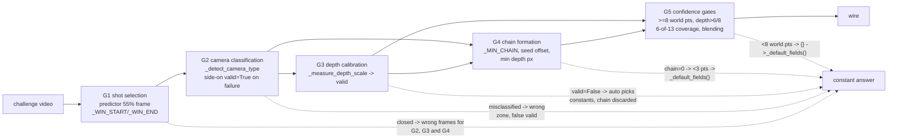

# Cricket Prediction Accuracy Bugfix Design

## Overview

The miner answers challenges successfully and scores near zero because the answer that reaches
the wire is not derived from the video. Live challenge 65705 returned HTTP 200 in 5.4 s and
scored 2.9%; the field scores 55.7%–73.5%.

The pipeline is `predictor.predict_cricket_delivery` → `PitchHomography(ref_frame)` →
`BallTracker.track` → `TrajectoryAnalyser.analyse`. Five gates sit along it. On every video
examined, at least one gate closes, and the answer degrades to one of two hardcoded 13-value
constant sets. Which gate closes varies by video, so no single component fix produces a
measurable change end to end.

A sixth defect sits behind all five gates and is not a CV problem at all: even with a perfectly
tracked delivery and a perfectly calibrated homography, `_select_confident_fields` can only
override 6 of the 13 scored fields, and it blends the two highest-weighted of those back toward
hardcoded defaults hard enough that a *perfect* measurement scores zero over most of the
plausible input range. That defect is arithmetic, provable offline with no video, and is the
only part of this bug that is verifiable in isolation.

The fix strategy, in dependency order:

1. **Repair the measurement loop first.** `cricket/validate.py` does not run (fixture paths
   moved), does not know about the one fixture whose groundtruth is a real un-fitted delivery,
   and re-composes the physics path in the harness instead of calling production. Nothing
   downstream can be evaluated until this works.
2. **Open the gates in order, measuring after each.** Shot selection (G1) and camera
   classification (G2) come first because every later gate reads their output. Depth calibration
   (G3), tracker thresholds (G4) and field derivation (G5) follow.
3. **Leave the mode default alone.** `CRICKET_PREDICTOR_MODE` stays `auto`. Flipping to
   `physics` is a decision for after physics is measured on a working harness across multiple
   labelled fixtures, not part of this fix.

This design states **no target score**. Physics has never run once with a depth axis measured
from a frame, on any fixture, so its ceiling is not knowable from what is on disk. Success is
defined per fixture as a strict improvement over the measured unfixed baseline.

## Glossary

- **Bug_Condition (C)** — a challenge video on which the miner emits an answer not derived from
  that video: the wrong shot was examined, the camera was misclassified, the depth axis was never
  measured, no chain formed, the chain came from the wrong shot, or the answer is a constant set.
- **Property (P)** — for a video satisfying C, the fixed pipeline returns 13 finite floats
  derived from the delivery in that video, inside the 30 s budget, scoring strictly better than
  the measured unfixed baseline wherever a groundtruth exists.
- **Preservation** — everything `cricket-miner-v3` delivered (reachability, axon, on-chain
  commitment, `/health`, header gate, image, `POST /challenge` contract, 30 s budget), plus the
  v2.5 constants rollback path, plus `analyse()`'s degrade-never-raise contract.
- **F** — the pipeline as it exists now. **F'** — the pipeline after this fix.
- **G1…G5** — the five gates (shot selection, camera classification, depth calibration, chain
  formation, confidence gates). See the interaction analysis below.
- **`_tuned_constant_fields()`** — the 13 scoring-tuned literals in `trajectory.py`; the v2.5
  baseline and the rollback path. `constants` mode returns these.
- **`_default_fields()`** — a *different* 13 literals; what `physics` mode degrades to. The two
  are not interchangeable and neither is a floor: on 8b97 they score 10.4% and 21.1%.
- **`valid`** — `PitchHomography`'s flag that `auto` gates physics on. On the end-on path it
  means the depth axis was measured. On the side-on path it currently means nothing (set on every
  branch including failures).
- **`anchor_calibrated`** — end-on: the wicket was found, so the anchor and transverse scale come
  from the frame. Set independently of `valid`; the tracker uses it either way.
- **delivery shot** — the contiguous run of frames showing the ball being bowled from a
  behind-the-arm camera. Distinct from close-ups, replays, crowd shots and, in one fixture, a
  segment from a different match.
- **world point** — a `(x_m, y_m)` pair produced by `hom.pixel_to_metres` and surviving
  `_analyse_endon`'s range filter. `_select_confident_fields` counts these, not chain pixels.

## Bug Details

### Bug Condition

The bug manifests on a challenge video whenever any one of six independent conditions holds.
They are independent in cause but not in observability: several of them collapse to the same
`chain=0` log line, which is why the live failure could not be diagnosed from logs alone.

**Formal Specification:**

```
FUNCTION isBugCondition(X)
  INPUT: X of type CricketChallengeVideo
  OUTPUT: boolean

  ref   ← frame(X, round(0.55 * frameCount(X)))     // predictor.py, hardcoded
  hom   ← PitchHomography(ref)
  chain ← BallTracker.track(X, hom)                 // scans 0.50-0.65, then all frames
  mode  ← resolveMode(hom)                          // auto -> physics iff hom.valid

  wrongShot      ← NOT deliveryVisibleIn(ref) OR NOT deliveryWithin(X, 0.50, 0.65)
  misclassified  ← isBehindTheArm(X) AND hom.camera_type = "side_on"
  falseValid     ← hom.valid AND NOT hom.depthAxisMeasuredFromFrame
  noDepthAxis    ← hom.camera_type = "end_on" AND hom.valid = FALSE
  noChain        ← |chain| = 0
  noiseChain     ← |chain| >= 8 AND NOT chainLiesInDeliveryShot(chain, X)
  constantAnswer ← mode = "constants"
                   OR (mode = "physics" AND worldPointCount(chain, hom) < 8)

  RETURN wrongShot OR misclassified OR falseValid OR noDepthAxis
         OR noChain OR noiseChain OR constantAnswer
END FUNCTION
```

### Examples

Measured on the unfixed pipeline, all four local fixtures plus the live challenge. Every row
satisfies `isBugCondition`, by a different disjunct.

| # | Video | Observed | Disjunct(s) | Answer that reached / would reach the wire |
|---|-------|----------|-------------|--------------------------------------------|
| 1 | live 65705 | `chain=0`, `valid=False`, `mode=auto → constants` | `noChain`, `noDepthAxis`, `constantAnswer` | `_tuned_constant_fields()` → **scored 2.9%** live |
| 2 | 8b97 (1920x1080/25/510) | `camera=side_on`, `valid=True`, `anchor_calibrated=False`, `chain=0`, `mode=physics` | `wrongShot`, `misclassified`, `falseValid`, `noChain`, `constantAnswer` | `_default_fields()` → **21.1%** vs its groundtruth |
| 3 | be13 (1920x1080/25/942) | `camera=end_on`, `valid=False`, `anchor_calibrated=True`, `chain=19`, `mode=constants` | `noDepthAxis`, `constantAnswer` | `_tuned_constant_fields()`; the 19-point chain is discarded unread |
| 4 | efc0 (1280x720/30/1213) | `camera=end_on`, `valid=False`, `anchor_calibrated=True`, `chain=26`, `mode=constants` | `noDepthAxis`, `constantAnswer` | `_tuned_constant_fields()`; the 26-point chain is discarded unread |
| 5 | f81d (1920x1080/25/813) | `camera=side_on`, `valid=True`, `chain=21`, `mode=physics` | `wrongShot`, `misclassified`, `falseValid` | side-on physics on fallback constants; unscoreable, no groundtruth |
| 6 | 8b97 forced end-on | `chain=12` at frames 316–329 (62–65%, a close-up) | `wrongShot`, `noiseChain` | overrides `{bounce_x: 8.37, kph: 79.12, …}` — physics fitted to noise |

Concrete evidence behind rows 2 and 5 — the shot-selection finding, from frame sampling:

- **8b97**: delivery footage at ≈15%, 25%, 35% (behind-the-arm wide shots). The frame at 55% —
  the frame the homography is calibrated from — is a head-and-shoulders close-up of a batter with
  no pitch, no stumps and no crease in it. Frames from 45% to 85% are close-ups and reaction
  shots. The frame at 95% is from a **different match**.
- **f81d**: delivery footage at ≈5%–15%; close-ups from 45% on.
- **be13** and **efc0**: delivery at 55%–65%. These are the two fixtures the constants were tuned
  on, which is why the 50–65% assumption was never caught.

Two quantitative examples that need no video at all:

- **`bounce_x` blending.** `overrides["bounce_x"] = measured * 0.6 + 4.0 * 0.4`. Tolerance
  0.25 m. Solving `|0.6b + 1.6 - b| < 0.25` gives `b ∈ (3.375, 4.625)`: a **perfect**
  measurement scores non-zero only if the truth is inside that 1.25 m window. Groundtruths:
  be13 4.082 (inside), efc0 6.743 (outside), 8b97 5.622 (outside). The highest-weighted field in
  the scoring function, zeroed by the blend on two of three labelled fixtures.
- **`kph` blending.** `measured * 0.6 + 88.0 * 0.4`, tolerance 3.0. Non-zero only for
  `k ∈ (80.5, 95.5)`. 8b97's groundtruth 95.32 lands just inside, scoring 0.024 of a possible
  1.0 from a hypothetically perfect measurement.

## Expected Behavior

### Preservation Requirements

**Unchanged Behaviors:**

- `POST /challenge` keeps its path, request body and response shape, returning
  `PredictionPayload(type="cricket_delivery", item=...)` with all 13 fields as finite floats,
  none `None`.
- `analyse()` degrades instead of raising for every degenerate input — empty, `None`, 1-point,
  2-point, stationary, out-of-frame, and a homography whose `pixel_to_metres` throws.
  `routes.py` converts any exception into a 500 and a 500 scores 0.
- `CRICKET_PREDICTOR_MODE=constants` returns exactly the recorded v2.5 item
  (`V25_CONSTANT_PREDICTION_ITEM`). The rollback path is preserved, not deleted.
- The default mode stays `auto`. Unknown/empty env values still fall back to it without raising.
- Every `cricket-miner-v3` outcome: dedicated IPv4 axon on port 8000 `ip_type=4`, the
  private-track on-chain commitment, `GET /health` → 200 without invoking the predictor, the
  `/challenge` header gate, `Dockerfile.v3`/`fly.toml` parity, warm machine, UID 207 identity.
- The container imports `cv2` and `numpy` with no new native dependency and no `libgl1`.
- `soccer_action` and TCG routing in `routes.py`.
- `_analyse_sideon` stays reachable and contract-compliant for genuinely side-on clips.
- The 30 s response budget, with the observed 5.4 s live run as the reference point.

**Scope:**

All inputs that do NOT involve deriving delivery fields from video should be completely
unaffected. That includes:

- the transport, security and discovery layers in their entirety (no axon extrinsic, no new
  on-chain commitment, no `fly.toml` service change, no `.env` edit);
- `constants` mode, in all modes of invocation;
- every degenerate-input path through `analyse()`;
- the `soccer_action` and TCG pillars;
- the response envelope and field contract.

The expected correct behaviour is in Correctness Properties below.

## Hypothesized Root Cause

Ordered by the confidence the evidence supports. Root causes 1, 2 and 5 are confirmed by
measurement; 3 and 4 are confirmed as present but their *contribution to the score* is not yet
separable.

**1. Shot selection is a fixed offset, and it is wrong on half the fixtures** (confirmed)

`predictor.py` hardcodes `delivery_start = int(frame_count * 0.55)` for the calibration frame and
`ball_tracker._WIN_START/_WIN_END = 0.50/0.65` for tracking. Broadcast challenge clips are
multi-shot montages: delivery, close-up, replay, reaction, and in one case a segment from a
different match. On 8b97 and f81d the delivery is in the first third and the 50–65% band is
close-ups. So the homography calibrates from a frame with no pitch in it and the tracker looks
for a ball in a shot that has none. The widening rescan then scans the whole clip with no
shot-boundary awareness, which is how a 12-point "chain" gets assembled inside a close-up.

This is the most parsimonious explanation for the live `chain=0` on challenge 65705.

**2. Camera-type misclassification, compounded by a `valid` flag that lies** (confirmed)

`_detect_camera_type` returns `side_on` on the first pair of vertical-edge clusters separated by
more than 25% of frame width. Two of four fixtures — both behind-the-arm — trip it. Then
`_try_calibrate_sideon` sets `self._valid = True` on all five of its exit paths, four of which
are explicit failures. The result is `valid=True` with nothing calibrated, so `auto` resolves to
`physics` and runs the depth-dominated physics path on the resolution-scaled
`_FALLBACK_SIDEON_*` constants, tracking with a side-on search zone that does not match the
geometry. Chain 0 on 8b97 through this path; 12 points on the same clip forced end-on.

Note the asymmetry this creates, and that it inverts part of the original framing: on end-on
clips `valid=False` masks tracker quality (the chain is discarded). On side-on-classified clips
the opposite happens — physics runs with no calibration behind it at all.

**3. The end-on depth axis has never been measured on any fixture** (present; contribution not
yet separable)

`_measure_depth_scale` looks for exactly one landmark, the batter's popping crease, as a
near-horizontal Hough segment at least `0.40 * 3.66 m` long, within 1.0 m of the anchor column,
in a row band derived from the very constant it is trying to replace. It has never returned a
value: be13 and efc0 both report `anchor_calibrated=True, valid=False`, and 65705 logged
`valid=False`. So `_px_per_m_depth` is always `_px_per_m_lat * 0.094`, where 0.094 is the mean of
two per-clip measurements 15% apart, and `_ENDON_CAMERA_DISTANCE_M = 90.0` is admitted in its own
comment to be unmeasurable from these clips. `bounce_x` — 23% of the score at 0.25 m tolerance —
is therefore a function of two constants fitted on two clips, not a measurement.

**4. Tracker thresholds are resolution-absolute and undiagnosable** (present; contribution not
yet separable)

`_ENDON_SEED_MIN_PY_OFFSET = 200` and `_ENDON_MIN_DEPTH_PX = 147` are fixed pixel counts sitting
alongside homography scales that are all resolution-relative. With the fallback scales, 200 px is
≈7.7 m of depth at 1920 wide and ≈11.1 m at 1280 wide, so the same threshold means different
cricket at different resolutions. The comments disagree with each other (13 m on line 37, 3.4 m
on line 91, for the same constant) and with the real scales (`_ENDON_MIN_DEPTH_PX` assumes
14.7 px/m; the actual values are ≈23.8 and ≈15.9). `_ENDON_MAX_LATERAL_PX` is dead code. And
because `_MIN_CHAIN = 8` is applied as a hard filter with no logging of which constraint
rejected which candidate, the only diagnostic emitted is `chain=0`.

**5. The physics path throws away 46% of the score and blends away the rest** (confirmed,
arithmetic)

`_select_confident_fields` can only ever produce 6 keys: `release_y`, `bounce_y`, `stump_y`,
`impact_y`, `bounce_x`, `kph`. The other 7 — `release_z`, `impact_x`, `impact_z`,
`interception_distance`, `stump_z`, `swing_angle`, `deviation`, carrying **0.46 of the total
weight** — are returned as `_default_fields()` constants on every call. `_analyse_endon` computes
all of them and they are discarded unconditionally. Of the 6 that survive, the two most valuable
are blended 0.6/0.4 toward hardcoded defaults, which zeroes a perfect `bounce_x` measurement
outside 3.375–4.625 m and a perfect `kph` measurement outside 80.5–95.5 kph.

This root cause is independent of every CV concern above and is provable with a unit test and no
video. It is also the only one that is verifiable in isolation.

### Gate interaction — why the ordering is load-bearing



Four consequences the task order must respect:

1. **G1 feeds G2, G3 and G4.** The calibration frame and the tracking window are both derived
   from the same fixed offset. Fixing camera classification or depth calibration while still
   handing them a close-up frame changes nothing. G1 is first, unconditionally.
2. **G3 and G4 mask each other on the end-on path.** With `valid=False`, `analyse()` returns
   constants and never reads the trajectory, so a tracker improvement is invisible. With
   `chain=0`, physics degrades below 3 points regardless of calibration. Both must open before
   any physics output reaches the wire on an end-on clip. This part of the original framing is
   confirmed exactly.
3. **G2 breaks that symmetry in the other direction.** On a side-on-*mis*classified clip,
   `valid=True` already routes to physics, so the masking runs the opposite way: physics executes
   on an uncalibrated homography. Fixing G2 will therefore make some clips resolve to
   `constants` where they currently resolve to `physics` — a *reduction* in physics execution
   that is nonetheless correct, and that may move a fixture's score in either direction. The
   harness must record this rather than treat it as a regression.
4. **G5's arithmetic defect is the exception.** It is provable and fixable with no CV and no
   video, so it can be verified in isolation ahead of the CV work. It cannot *improve the score*
   ahead of the CV work, because with G1–G4 closed there is no measurement to un-blend. Fix it
   early because it is cheap and certain; measure its effect only after G1–G4 open.

## Correctness Properties

Property 1: Bug Condition - Prediction Derived From The Video

_For any_ challenge video where the bug condition holds (`isBugCondition` returns true), the
fixed pipeline SHALL select a delivery shot in which the pitch geometry is visible, classify a
behind-the-arm clip as `end_on`, report `valid` only when the axis physics depends on was
measured from a frame, form a chain that lies inside the selected delivery shot, and return 13
finite floats that are neither `_tuned_constant_fields()` nor `_default_fields()` — within the
30 s budget. Where a groundtruth exists, the validator score of that answer SHALL be strictly
greater than the measured unfixed baseline for the same fixture.

**Validates: Requirements 2.1, 2.2, 2.3, 2.5, 2.6, 2.7, 2.9, 2.12, 2.16, 2.18, 2.27**

Property 2: Preservation - Everything Not On The Prediction Path

_For any_ input where the bug condition does NOT hold (`isBugCondition` returns false), the fixed
pipeline SHALL produce the same result as the original, preserving `constants` mode's exact v2.5
values, the `auto` default and its env-var parsing, `analyse()`'s degrade-never-raise contract
over every degenerate input, the `POST /challenge` request/response contract, `GET /health`,
the header gate, the axon and on-chain commitment, container imports, the `soccer_action` and
TCG paths, and the 30 s budget.

**Validates: Requirements 3.1, 3.2, 3.3, 3.4, 3.5, 3.6, 3.7, 3.8, 3.9, 3.10, 3.11**

Property 3: Blending - A Perfect Measurement Scores Perfectly

_For any_ measured field value equal to the groundtruth, the fixed field-derivation step SHALL
return a value whose validator score is 1.0. Stated as the counterexample it replaces: under the
current 0.6/0.4 blend, a perfect `bounce_x` of 5.622 returns 4.973 and scores 0, and a perfect
`kph` of 129.21 returns 112.72 and scores 0. This property holds over the full plausible range
of each field, not merely near the default.

**Validates: Requirements 2.17**

Property 4: Field Coverage - Every Computed Field Can Reach The Wire

_For any_ trajectory the physics path accepts, each of the 13 scored fields that
`_analyse_endon`/`_analyse_sideon` computed SHALL be capable of appearing in the returned answer.
No field SHALL be replaced by a `_default_fields()` constant purely because
`_select_confident_fields` has no branch for it. Today 7 fields carrying 0.46 of the total weight
are discarded unconditionally.

**Validates: Requirements 2.16**

Property 5: Diagnosability - Every Gate Closure Is Distinguishable From Logs

_For any_ video on which the pipeline degrades, the log SHALL identify which gate closed: which
shot was selected and why, the camera-type decision and its evidence, whether the depth axis was
measured, which tracker constraint rejected which candidate chain, how many world points
survived, and which constant set was returned. Today five distinct causes collapse to
`chain=0` plus `mode=auto → constants`.

**Validates: Requirements 2.4, 2.8, 2.13, 2.19**

Property 6: Harness Fidelity - The Harness Measures Production

_For any_ labelled fixture, the offline harness SHALL score production's own `analyse()` output
using the validator's own weights, tolerances and comparison semantics as read from
`scorevision/validator/central/private_track/scoring.py`, SHALL resolve every fixture at its real
path including those under `foundation/`, SHALL take truth only from the `groundtruth` block, and
SHALL report per-gate diagnostics alongside the score.

**Validates: Requirements 2.20, 2.21, 2.22, 2.23, 2.24, 2.25, 2.26**

## Fix Implementation

### Changes Required

Assuming the root-cause analysis above is correct. Each item names the gate it opens; the
exploration tasks in `tasks.md` confirm or refute before the corresponding change is made.

**Step 0 — the measurement loop**

**File**: `cricket/validate.py`

1. **Fixture resolution**: resolve each fixture by searching `FIXTURE_DIR` and its
   `foundation/` subdirectory rather than assuming a flat layout, so the existing `be13`/`efc0`
   entries resolve again.
2. **Register the remaining fixtures**: add `8b97` (video + `groundtruth-8b97.json`) and `f81d`
   (video, no groundtruth). `f81d` runs as a behaviour probe and is reported explicitly as
   unscoreable rather than silently skipped or scored against nothing.
3. **Call production, not a re-composition**: replace `real_pipeline()` with a call to
   `TrajectoryAnalyser.analyse()` under each of `constants`, `physics` and `auto`
   (`CRICKET_PREDICTOR_MODE`), so the harness cannot drift from `_physics_fields`.
4. **Assert scoring parity**: import or verify `WEIGHTS`/`TOLERANCES` against
   `_CRICKET_FIELD_WEIGHTS`/`_CRICKET_FIELD_TOLERANCES` in `scoring.py`, including the
   `distance >= tolerance` boundary and the `[0, 1]` clamp, so the harness cannot silently
   disagree with the validator.
5. **Per-gate diagnostics**: emit selected shot range, camera type, `valid`,
   `anchor_calibrated`, chain length, chain frame range as a percentage of the clip, world-point
   count, depth travel, y-spread, which fields passed the gates, which constant set was returned,
   and tracking wall-clock.
6. **Rename the vocabulary**: `stub`/`real` → `constants`/`physics`/`auto`, matching the modes
   that actually exist.

**File**: `cricket/turbovision/tests/private/v25_recorded_baseline.py`

7. Fix `CRICKET_FIXTURES`/`V25_FIXTURE_VIDEOS` so the three fixture-path tests resolve the
   `foundation/` layout. This is a path repair only — the recorded baseline values do not change.

**Step 1 — G1 shot selection**

**File**: `cricket/turbovision/scorevision/miner/private_track/video.py` (new helper) and
`ball_tracker.py`, `predictor.py`

8. **Shot segmentation**: split the clip into shots by frame-to-frame similarity (grayscale
   histogram correlation or mean absolute difference on a downscaled frame) over a strided sample,
   not every frame, so the cost stays bounded.
9. **Delivery-shot scoring**: score each shot by reusing `PitchHomography._detect_wicket_endon`
   / `_vertical_bars` on a representative frame — a centred group of thin vertical bars with a
   plausible transverse scale is the strongest available evidence of a behind-the-arm pitch view,
   and reusing it adds no new machinery. Pick the highest-scoring shot of sufficient duration.
10. **One source of truth**: `predictor.py`'s calibration frame and the tracker's search window
    both come from the selected shot. The `0.55` literal and `_WIN_START`/`_WIN_END` are replaced,
    not supplemented.
11. **Chain confinement**: the widening rescan searches other *shots*, in descending score order,
    and never assembles a chain across a shot boundary.
12. **Failure is named**: when no shot scores as a pitch view, log "no delivery shot found" and
    degrade — distinct from `chain=0`.

**Step 2 — G2 camera classification and honest validity**

**File**: `pitch_homography.py`

13. **Classify on wicket evidence, not edge separation**: `end_on` when
    `_detect_wicket_endon` finds a centred wicket group with a plausible transverse scale;
    `side_on` only when two wicket-like clusters are separated by roughly
    `PITCH_LENGTH_M * px_per_m`. Replace the "any two clusters >25% of width apart" heuristic.
14. **`valid` stops lying on the side-on path**: `_try_calibrate_sideon` sets `_valid = True`
    only on its success path. All four failure branches leave it False and continue to use the
    resolution-scaled fallbacks, exactly as the end-on path already does. Keep the fallbacks
    available to the tracker via `anchor_calibrated`.
15. **Log the decision**: cluster count, separation in metres, chosen type, and the wicket
    evidence that decided it.
16. **Reconcile the docstrings**: one stated meaning for `valid`, matching the code.

**Step 3 — G3 depth calibration**

**File**: `pitch_homography.py`

17. **More than one depth landmark.** `_measure_depth_scale` currently accepts only the batter's
    popping crease and has never succeeded. Add candidates and take the first that passes its own
    plausibility check, recording which one was used:
    - the **bowler's-end wicket** at `PITCH_LENGTH_M` = 20.12 m, a long baseline and therefore
      the most accurate when the shot is wide enough to contain it;
    - the **return-crease stroke length** (1.22 m), which is already how
      `_ENDON_DEPTH_PER_TRANSVERSE` was derived — measuring it per video turns a constant into a
      measurement;
    - the existing **popping crease**, retained.
18. **Do not gate on the derived scale.** Keep serving the derived depth scale to the tracker when
    no landmark is found (this already works via `anchor_calibrated`); only `valid` changes.
19. **Report the provenance** of `_px_per_m_depth` — measured from which landmark, or derived — in
    the log and in the harness diagnostics.

**Step 4 — G4 tracker thresholds**

**File**: `ball_tracker.py`

20. **Express thresholds in metres.** Replace `_ENDON_SEED_MIN_PY_OFFSET` and
    `_ENDON_MIN_DEPTH_PX` with metre constants converted through the homography's own scales, so
    they mean the same cricket at 720p and 1080p.
21. **Log rejections.** For each candidate chain, log which constraint rejected it and the failing
    value (seed depth, total depth travel, chain length, speed bound, lateral jitter). `chain=0`
    must never be the only diagnostic.
22. **Resolve the dead and stale constants.** Apply `_ENDON_MAX_LATERAL_PX` or delete it; correct
    the three comments that contradict each other and the real scales.
23. **Report a partial chain.** Keep `_MIN_CHAIN` as the acceptance threshold, but return/log the
    best sub-threshold chain so "5 points, rejected" is visible.

**Step 5 — G5 field derivation**

**File**: `trajectory.py`

24. **Cover all 13 fields.** `_select_confident_fields` gains a branch for each field
    `_analyse_endon`/`_analyse_sideon` computes, so the 7 fields carrying 0.46 of the weight can
    reach the wire. Per-field confidence, not one all-or-nothing block.
25. **Remove the accuracy-destroying blend.** A field that passes its confidence check is returned
    as measured. If any shrinkage toward a prior is retained it must be justified against a
    harness measurement, and must not be able to push a correct measurement outside the
    validator's tolerance (Property 3).
26. **Confidence must mean "this is a delivery".** Add the shot-membership evidence from Step 1 to
    the gate, so the clause-1.24 noise chain is rejected rather than blended.
27. **Name the fallback in the log.** State which constant set was returned
    (`_tuned_constant_fields` vs `_default_fields`) and which condition caused it.
28. **Do not touch the mode default.** `_DEFAULT_MODE` stays `_MODE_AUTO`. Update the module
    comment's measured table only from a working-harness run, and keep the caveat that the
    historical physics numbers were taken with `valid=False` on both fixtures.

**Explicitly out of scope**

- Any change to `fly.toml`, `Dockerfile.v3`, `server.py`, `security.py`, `routes.py`, the axon,
  or the on-chain commitment.
- Any new paid or rate-limited on-chain extrinsic. At most one redeploy of an image whose
  dependency set is unchanged.
- Adding a learned ball detector or any new model weight to the image. Out of scope here because
  it changes the image size the spot-check pulls and the CPU budget; revisit only if the classical
  detector is measured insufficient after Steps 1–5.
- Flipping `CRICKET_PREDICTOR_MODE` to `physics`.
- `.env`.

## Testing Strategy

### Validation Approach

Two phases. First, surface counterexamples on the **unfixed** code that separate the six
disjuncts of the bug condition empirically — this is the whole reason the spec exists, since
`chain=0` alone cannot distinguish "no delivery shot" from "delivery shot, tracker failed".
Second, verify the fix works and preserves everything off the prediction path.

The harness repair (Step 0) comes before both, because neither phase is measurable without it.

### Exploratory Bug Condition Checking

**Goal**: Surface counterexamples that demonstrate the bug BEFORE implementing the fix. Confirm
or refute the root-cause analysis per gate. If a gate is refuted, re-hypothesise before writing
the corresponding change.

**Test Plan**: Instrument the unfixed pipeline over all four local fixtures and record, per
fixture: the selected calibration frame and whether the pitch is visible in it, the delivery
shot's actual location as a percentage of the clip, camera type, `valid`, `anchor_calibrated`,
which depth landmark (if any) was found, chain length, the chain's frame range as a percentage,
world-point count, depth travel, y-spread, which fields passed the gates, the resolved mode,
which constant set was returned, the validator score where a groundtruth exists, and tracking
wall-clock. Run on UNFIXED code.

**Test Cases**:

1. **Shot-location probe** — sample frames across each clip and record where the delivery is
   (will show 8b97 ≈15–35% and f81d ≈5–15%, outside the 50–65% window).
2. **Calibration-frame probe** — assert the pitch is visible in the frame at 55% (will fail on
   8b97 and f81d).
3. **Camera-classification probe** — assert behind-the-arm clips classify `end_on` (will fail on
   8b97 and f81d).
4. **Side-on validity probe** — drive `_try_calibrate_sideon` down each of its four failure
   branches and assert `valid` is False (will fail on all four — it is set unconditionally).
5. **Depth-landmark probe** — assert `valid=True` on at least one end-on fixture (will fail on
   both; neither has ever produced a measured depth axis).
6. **Chain probe** — record chain length and frame range per fixture (be13 19, efc0 26, 8b97 0
   via side-on, 12 via forced end-on at 62–65% — a close-up).
7. **Noise-chain probe** — assert `_select_confident_fields` rejects the 8b97 forced-end-on chain
   (will fail; it accepts it and emits `bounce_x=8.37`, `kph=79.12`).
8. **Field-coverage probe** — assert every field `_analyse_endon` computes can appear in
   `analyse()`'s output (will fail for the 7 fields carrying 0.46 of the weight).
9. **Blending probe** — no video: feed the groundtruth value as the measured value and assert the
   returned value scores 1.0 (will fail for `bounce_x` outside 3.375–4.625 m and `kph` outside
   80.5–95.5 kph).
10. **Constant-floor probe** — score `_tuned_constant_fields()` and `_default_fields()` against
    the 8b97 groundtruth independently of the hand computation (expect ≈10.4% and ≈21.1%).
11. **Reference-ceiling probe** — score `groundtruth-8b97.json`'s `miner_response.prediction`
    against its own `groundtruth` block (expect ≈79.7%), establishing that the labels are
    attainable from the video.
12. **Latency probe** — record tracking wall-clock per fixture, in the container, as the baseline
    the 30 s budget is measured against.

**Expected Counterexamples**:

- The calibration frame contains no pitch on 8b97 and f81d.
- Behind-the-arm clips classified `side_on`, with `valid=True` and nothing calibrated.
- `valid=False` on every end-on fixture; no depth axis has ever been measured.
- `chain=0` arising from at least two distinct causes (wrong shot; wrong search zone).
- A chain of 12 accepted by the confidence gates from inside a close-up shot.
- A perfect measurement scoring 0 after blending.
- Possible causes if a probe disagrees: the shot detector's notion of "pitch visible" is wrong;
  the fixtures are not representative of live traffic; `scoring.py` in the deployed validator
  differs from the copy in this repo.

### Fix Checking

**Goal**: Verify that for all inputs where the bug condition holds, the fixed function produces
the expected behaviour.

**Pseudocode:**

```
FOR ALL video WHERE isBugCondition(video) DO
  shot   := selectDeliveryShot_fixed(video)
  hom    := PitchHomography_fixed(referenceFrame_fixed(video, shot))
  chain  := BallTracker_fixed.track(video, hom, shot)
  result := TrajectoryAnalyser_fixed(hom).analyse(chain)

  ASSERT pitchVisibleIn(referenceFrame_fixed(video, shot))
  ASSERT isBehindTheArm(video) IMPLIES hom.camera_type = "end_on"
  ASSERT hom.valid IMPLIES hom.depthAxisMeasuredFromFrame
  ASSERT chainLiesInDeliveryShot(chain, video)
  ASSERT result NOT IN {tunedConstantFields(), defaultFields()}
  ASSERT |result| = 13 AND all finite AND none NULL
  ASSERT wallClock(video) < 30 s
  IF hasGroundtruth(video) THEN
    ASSERT validatorScore(result) > unfixedBaselineScore(video)
  END IF
END FOR
```

The score assertion is per fixture against its own measured unfixed baseline, not against a
threshold. Baselines to beat: 8b97 21.1% (its real production path today) — 10.4% is the
`constants`-mode figure and is the wrong comparator for that fixture. be13's and efc0's baselines
must be re-measured on the repaired harness before being quoted; the 92.8%/19.4%/43.2%/22.1%
numbers in `trajectory.py`'s module comment came from a harness that no longer runs and from
physics on `valid=False` calibration.

### Preservation Checking

**Goal**: Verify that for all inputs where the bug condition does NOT hold, the fixed function
produces the same result as the original function.

**Pseudocode:**

```
FOR ALL input WHERE NOT isBugCondition(input) DO
  ASSERT pipeline_original(input) = pipeline_fixed(input)
END FOR
```

**Testing Approach**: Property-based testing is recommended for preservation checking because:

- it generates many test cases automatically across the input domain;
- it catches edge cases manual unit tests miss — and this pipeline's history is entirely of
  edge cases that were not in the two fixtures it was tuned on;
- it gives a strong guarantee that behaviour is unchanged for all non-buggy inputs, which matters
  most for the degenerate-input contract, where the alternative is a 500 and a score of 0.

**Test Plan**: Observe behaviour on UNFIXED code first — `constants`-mode output for arbitrary
trajectories, `analyse()` over every degenerate input, `resolve_mode()` over arbitrary env
values, the `POST /challenge` contract, `/health`, the header gate, the axon and commitment
readback, container imports — then write property-based tests capturing exactly that.

**Test Cases**:

1. **Constants-mode invariance**: observe that `constants` mode returns
   `V25_CONSTANT_PREDICTION_ITEM` for arbitrary trajectories on unfixed code, then property-test
   over generated trajectories that it still does.
2. **Degenerate-input contract**: observe that empty/`None`/1-point/2-point/stationary/
   out-of-frame trajectories and an exploding homography all return 13 finite floats, then
   property-test over generated degenerate inputs that none raises.
3. **Mode parsing**: observe that unset, empty, whitespace, wrong-case and nonsense
   `CRICKET_PREDICTOR_MODE` values resolve as they do today, then property-test over generated
   strings that the default stays `auto` and nothing raises.
4. **Field contract**: property-test that every mode × calibration-state combination returns
   exactly `TRAJECTORY_FIELDS`, all finite floats, no `None`, no extra keys.
5. **HTTP contract**: observe the `POST /challenge` response shape and `/health` behaviour, then
   assert unchanged.
6. **v3 reachability**: re-read `axon_info` and the on-chain commitment and assert unchanged —
   read-only, no extrinsic.
7. **Container imports**: rebuild and assert `import cv2, numpy` still succeeds with no new
   native dependency.
8. **Side-on physics**: property-test that genuinely side-on input still satisfies the contract.
9. **Latency**: assert per-fixture wall-clock stays inside the budget with the recorded baseline
   as the comparator.

### Unit Tests

- Blending arithmetic: for each of `bounce_x` and `kph`, a measured value equal to groundtruth
  returns a value scoring 1.0 (Property 3). No video.
- Field coverage: every key `_analyse_endon`/`_analyse_sideon` produces is reachable through
  `analyse()` (Property 4). No video.
- Scoring parity: the harness's weights, tolerances, `err >= tol` boundary and `[0, 1]` clamp
  match `scoring.py` exactly (Property 6).
- Side-on validity: each of `_try_calibrate_sideon`'s four failure branches leaves `valid` False.
- Threshold conversion: the same metre threshold produces proportional pixel thresholds at
  1280x720 and 1920x1080.
- Shot segmentation: a synthetic multi-shot clip is split at the right frames, and a chain is
  never assembled across a boundary.
- Fixture resolution: every labelled fixture resolves from both the flat and `foundation/`
  layouts; `f81d` is reported unscoreable rather than skipped or scored.
- Fallback naming: the log states which constant set was returned and why.

### Property-Based Tests

- **Property 1 (Bug Condition)**: over the labelled fixtures, the fixed pipeline returns an
  answer that is neither constant set, from a chain inside the selected delivery shot, scoring
  strictly better than that fixture's measured unfixed baseline. The input domain here is 3–4
  real videos, so this is a **scoped** property over concrete cases, not a generated space —
  reproducibility matters more than breadth with n this small, and the spec says so rather than
  implying statistical strength it does not have.
- **Property 2 (Preservation)**: over generated trajectories, generated degenerate inputs and
  generated env-var strings, `constants` mode, the field contract, the degrade-never-raise
  contract and mode parsing are unchanged.
- **Property 3 (Blending)**: over generated `(measured, groundtruth)` pairs where the two are
  equal, spanning the full plausible range of each field, the returned value scores 1.0.
- **Property 4 (Field Coverage)**: over generated synthetic trajectories on a calibrated
  homography, no field that the analyser computed is silently replaced by a default.

Note on tooling: `hypothesis` is not currently a dependency, and `cricket-miner-v3` deliberately
chose exhaustive `parametrize` over adding it where the domain was small enough to enumerate.
Properties 3 and 4 have small enumerable domains and should follow that precedent. Property 2's
generated-string and generated-trajectory domains do not, so either add `hypothesis` to the dev
dependencies or enumerate a documented representative set — pick one and record the choice, as
task 6.4 of the v3 spec did.

### Integration Tests

- Full `POST /challenge` against a local HTTP server for each labelled fixture, through the real
  route, asserting the response contract, the score against groundtruth and the wall-clock.
- The same for `f81d` and for the downloaded challenge-65705 video, asserting behaviour only —
  a delivery shot was selected, a chain formed inside it, 13 finite floats returned, inside
  budget — since neither can be scored.
- Mode matrix: `constants`, `physics` and `auto` end-to-end on one fixture, asserting `constants`
  still returns the v2.5 item byte for byte.
- Container run: the built image answers a challenge and the answer matches the host run.
- Post-deploy: watch `fly logs` for the next live challenge and record the new diagnostics
  (selected shot, camera type, depth-landmark provenance, chain length, resolved mode) against
  the score the dashboard reports. This is the only end-to-end signal on live traffic, it arrives
  on the validator's schedule rather than ours, and its groundtruth is never visible.
