# Implementation Plan

## Overview

Spine: the design's five gates, in dependency order. The order is load-bearing — G1 (shot
selection) feeds the calibration frame and the tracking window that G2, G3 and G4 all read, so
fixing anything downstream while still handing it a close-up frame changes nothing measurable.
G3 and G4 mask each other on the end-on path (with `valid=False` the trajectory is never read;
with `chain=0` physics degrades below 3 points), so neither is independently verifiable
end-to-end. G5's arithmetic defect is the one exception: it is provable with no video, so it is
fixed early and cheaply, but its effect on the score cannot be measured until G1–G4 open.

Task 1 repairs the measurement harness before it probes anything, because `cricket/validate.py`
does not currently run at all. That repair is test infrastructure, not part of the fix.

This plan states **no target score**. Physics has never executed once with a depth axis measured
from a frame, so its ceiling is unknown. Success is per fixture: strictly better than that
fixture's own measured unfixed baseline.

Test framework: `pytest` + `pytest-asyncio`, `testpaths = ["tests"]`. New tests go in
`tests/private/`, alongside `test_v25_baseline_predictions.py` and `test_header_gate.py`. Note
that `tests/fixtures/key_fixtures.py` imports `nacl` at collection time, so the suite needs the
project venv (`.venv-sv` / `.venv-bt`, both POSIX/WSL) — the Windows `.venv` cannot collect it.

All harness runs are from the repo root (`python cricket/validate.py`); all `pytest`, `sv` and
`fly` commands from `cricket/turbovision`.

Code changes go to `fapulito/scoreturbo`, branch `cricket-miner-v3`, path `cricket/turbovision`
(plus `cricket/validate.py`). The spec lives in `fapulito/ibmbob` under `.kiro/specs/`.

---

## Task Dependency Graph

```mermaid
graph TD
    subgraph MEASURE["Measurement loop and baselines — free, must precede everything"]
        T1["1. Harness repair + bug condition probes<br/>Gate 0a is a hard STOP"]
        T2["2. Preservation baselines<br/>observed on unfixed code"]
    end

    subgraph CVFREE["CV-independent — provable with no video"]
        T31["3.1 G5 arithmetic<br/>blending + field coverage"]
    end

    subgraph CV["CV work — ordered, each measured after"]
        T32["3.2 G1 shot selection"]
        T33["3.3 G2 camera classification<br/>+ honest valid"]
        T34["3.4 G3 depth landmarks"]
        T35["3.5 G4 tracker thresholds<br/>+ rejection logging"]
        T36["3.6 G5 re-gate on<br/>shot membership"]
    end

    T37{{"3.7 DECISION GATE — measured, not assumed<br/>keep auto, or propose physics"}}

    T38["3.8 Verify Property 1<br/>re-runs task 1 probes"]
    T39["3.9 Verify Property 2<br/>re-runs task 2 tests"]
    T310["3.10 Latency budget check"]
    T4["4. Checkpoint — all tests pass"]
    T5["5. USER — redeploy and observe live<br/>optional, validator's schedule"]

    T1 --> T31
    T1 --> T32
    T2 --> T39
    T32 --> T33
    T33 --> T34
    T33 --> T35
    T32 --> T35
    T32 --> T36
    T31 --> T36
    T34 --> T37
    T35 --> T37
    T36 --> T37
    T37 --> T38
    T37 --> T310
    T38 --> T4
    T39 --> T4
    T310 --> T4
    T4 --> T5

    classDef gate fill:#ffe6cc,stroke:#d79b00,stroke-width:3px
    classDef optional fill:#f5f5f5,stroke:#999999,stroke-dasharray: 5 5
    class T37 gate
    class T5 optional
```



Edge legend:

- **`1 --> 3.2 --> 3.3 --> {3.4, 3.5} --> 3.7`** is the load-bearing chain. G1 supplies the frame
  and window that G2, G3 and G4 read; G2 supplies the camera type that decides which calibration
  and which tracker path run at all. Reordering these makes the measurement after each step
  meaningless, because the input to the step under test is still wrong.
- **`3.1` is deliberately off that chain.** The blending and field-coverage defects are arithmetic
  and provable with no video, so they are fixed first and cheaply. They cannot raise the score
  until G1–G4 open, because with those gates closed there is no measurement to un-blend.
- **`3.2 --> 3.6`** — the confidence gate can only require shot membership once shot selection
  exists.
- **Task 3.7 is a decision gate, not a code change.** It exists so the `CRICKET_PREDICTOR_MODE`
  default is changed only against a harness measurement, or deliberately left alone. Leaving it
  at `auto` is a valid and expected outcome.
- **Task 5 is optional and outside our control** — live challenges arrive on the validator's
  schedule and their groundtruth is never visible, so it can confirm behaviour but not score
  causation.

Wave definitions — tasks within a wave may run in parallel; waves run in order.

```json
{
  "waves": [
    {
      "wave": 1,
      "name": "Measurement loop, probes and baselines",
      "tasks": [
        { "id": "1", "dependsOn": [] },
        { "id": "2", "dependsOn": [] }
      ]
    },
    {
      "wave": 2,
      "name": "CV-independent arithmetic fix and shot selection",
      "tasks": [
        { "id": "3.1", "dependsOn": ["1"] },
        { "id": "3.2", "dependsOn": ["1"] }
      ]
    },
    {
      "wave": 3,
      "name": "Camera classification",
      "tasks": [
        { "id": "3.3", "dependsOn": ["3.2"] }
      ]
    },
    {
      "wave": 4,
      "name": "Depth calibration, tracker thresholds, confidence re-gate",
      "tasks": [
        { "id": "3.4", "dependsOn": ["3.3"] },
        { "id": "3.5", "dependsOn": ["3.2", "3.3"] },
        { "id": "3.6", "dependsOn": ["3.1", "3.2"] }
      ]
    },
    {
      "wave": 5,
      "name": "Measured decision gate",
      "tasks": [
        { "id": "3.7", "dependsOn": ["3.4", "3.5", "3.6"] }
      ]
    },
    {
      "wave": 6,
      "name": "Fix and preservation validation",
      "tasks": [
        { "id": "3.8", "dependsOn": ["3.7"] },
        { "id": "3.9", "dependsOn": ["2", "3.7"] },
        { "id": "3.10", "dependsOn": ["3.7"] }
      ]
    },
    {
      "wave": 7,
      "name": "Final checkpoint",
      "tasks": [
        { "id": "4", "dependsOn": ["3.8", "3.9", "3.10"] }
      ]
    },
    {
      "wave": 8,
      "name": "Live observation — optional, validator's schedule",
      "optional": true,
      "tasks": [
        { "id": "5", "dependsOn": ["4"] }
      ]
    }
  ]
}
```

## Tasks

- [x] 1. Repair the harness, then write bug condition exploration probes (BEFORE any fix)
  - **Property 1: Bug Condition** - Prediction Derived From The Video
  - **CRITICAL**: These probes MUST FAIL / reproduce the bug on unfixed code — failure confirms
    the bug exists
  - **DO NOT attempt to fix the code when they fail**
  - **NOTE**: These probes encode the expected behaviour; they validate the fix when they pass
    after implementation
  - **GOAL**: Separate the six disjuncts of `isBugCondition` empirically. `chain=0` alone cannot
    distinguish "no delivery shot in the window" from "delivery shot found, tracker failed", and
    that ambiguity is the whole reason this spec exists
  - **Scoped PBT Approach**: The input domain is 4 real videos plus one undownloaded live clip,
    not a generated space, so scope the property to those concrete cases and assert per fixture.
    With n this small, reproducibility matters more than breadth — do not dress it up as a
    statistical guarantee
  - **Gate 0a — STOP GATE, harness must run**: `cricket/validate.py` currently prints "video not
    found" for both fixtures, because `FIXTURE_DIR` is `turbovision/data-training/cricket` while
    `be1382745e….mp4` and `efc05ed4ef….mp4` are in that directory's `foundation/` subdirectory.
    Repair fixture resolution to search both layouts, register the `8b97` pair (video +
    `groundtruth-8b97.json`) and `f81d` (video only, **no groundtruth** — report it as
    unscoreable, do not skip it and do not score it against nothing). If the harness still cannot
    produce a score for be13, efc0 and 8b97, **STOP and re-plan** — every later task is
    unmeasurable without it
  - Gate 0b — same repair in `tests/private/v25_recorded_baseline.py`: `CRICKET_FIXTURES` /
    `V25_FIXTURE_VIDEOS` resolve the be13/efc0 files directly under `data-training/cricket`, so
    `test_cricket_fixtures_are_present`,
    `test_fixture_groundtruth_matches_what_was_recorded` and
    `test_fixture_miner_response_block_is_not_the_groundtruth` reference paths that no longer
    exist. Path repair only — the recorded baseline **values** must not change
  - Gate 0c — harness fidelity: replace `validate.py`'s `real_pipeline()` re-composition with
    calls to production's own `TrajectoryAnalyser.analyse()` under `CRICKET_PREDICTOR_MODE` of
    `constants`, `physics` and `auto`, so the harness cannot drift from `_physics_fields`. Verify
    `WEIGHTS`/`TOLERANCES` against `_CRICKET_FIELD_WEIGHTS`/`_CRICKET_FIELD_TOLERANCES` in
    `scorevision/validator/central/private_track/scoring.py`, including the
    `distance >= tolerance` boundary and the `[0, 1]` clamp. Rename the `stub`/`real` vocabulary
    to `constants`/`physics`/`auto`. Preserve the existing correct handling of the fixture JSONs:
    truth from the `groundtruth` block, `miner_response.prediction` as a reference column only —
    every local groundtruth file carries a foreign `miner_hotkey`
  - Gate 0d — per-gate diagnostics in the harness output: selected shot range, camera type,
    `valid`, `anchor_calibrated`, which depth landmark was found, chain length, chain frame range
    as a percentage of the clip, world-point count, depth travel, y-spread, which fields passed
    the confidence gates, resolved mode, which constant set was returned, tracking wall-clock
  - Probe 1 — **shot location**: sample frames across each clip and record where the delivery
    actually is. Expect 8b97 ≈15–35% and f81d ≈5–15%, both outside the 50–65% window; be13 and
    efc0 at 55–65%
  - Probe 2 — **calibration frame**: assert the pitch is visible in the frame at
    `int(frame_count * 0.55)`. Expect FAILURE on 8b97 (a head-and-shoulders close-up of a batter)
    and f81d
  - Probe 3 — **camera classification**: assert behind-the-arm clips classify `end_on`. Expect
    FAILURE on 8b97 and f81d, both reported `side_on`
  - Probe 4 — **side-on validity**: drive `_try_calibrate_sideon` down each of its four failure
    branches ("no lines", "insufficient vertical lines", "insufficient clusters", "span too
    small") and assert `valid` is False. Expect FAILURE on all four — it is set unconditionally
  - Probe 5 — **depth landmark**: assert `valid=True` on at least one end-on fixture. Expect
    FAILURE on both; record `anchor_calibrated=True, valid=False` for be13 (cx=1019, base=598,
    px/m_lat=225.0, 3 bars) and efc0 (cx=649, base=442, px/m_lat=144.1, 2 bars)
  - Probe 6 — **chain**: record chain length and frame range per fixture. Expect be13 19, efc0 26,
    8b97 0 via the production side-on path, and 12 at frames 316–329 (62–65%, inside a close-up)
    when the same clip is forced onto the end-on path
  - Probe 7 — **noise chain**: assert `_select_confident_fields` rejects the 8b97 forced-end-on
    chain. Expect FAILURE — it accepts it and emits `bounce_x=8.37`, `kph=79.12`. **Consequence:
    any success criterion phrased as "chain length ≥ N" is invalid and must not be written into a
    later task**
  - Probe 8 — **field coverage**: assert every field `_analyse_endon` computes can appear in
    `analyse()`'s output. Expect FAILURE for `release_z`, `impact_x`, `impact_z`,
    `interception_distance`, `stump_z`, `swing_angle`, `deviation` — 7 fields carrying 0.46 of the
    total weight, discarded unconditionally
  - Probe 9 — **blending**, no video needed: feed the groundtruth value in as the measured value
    and assert the returned value scores 1.0. Expect FAILURE for `bounce_x` outside
    3.375–4.625 m and `kph` outside 80.5–95.5 kph
  - Probe 10 — **constant floor**: score `_tuned_constant_fields()` and `_default_fields()`
    against the 8b97 groundtruth through the harness rather than by hand. Expect ≈10.4% and
    ≈21.1%. **Record which of the two is 8b97's real production baseline** — it resolves to
    `physics` with 0 points, so `_default_fields()` at ≈21.1% is the comparator, not 10.4%
  - Probe 11 — **reference ceiling**: score `groundtruth-8b97.json`'s
    `miner_response.prediction` against its own `groundtruth` block. Expect ≈79.7%, establishing
    that the labels are attainable from the video by a CV pipeline
  - Probe 12 — **latency baseline**: record tracking wall-clock per fixture, in the container.
    Host-side reference from the investigation (not the container): 8b97 6.9 s, f81d 8.7 s (both
    took the full-clip rescan), be13 1.8 s, efc0 1.1 s; the live 65705 run was 5.4 s total
    including download
  - Probe 13 — **live clip, behaviour only**: download
    `https://scoredata.me/cricket/a97a57a1bbd41eb3b27b60d3b39bce2daa68da44.mp4` and record camera
    type, `valid`, chain length and resolved mode. There is **no groundtruth for challenge
    65705** — the protocol withholds it from miners — so this reproduces behaviour
    (`chain=0`/`valid=False`) and can never be scored. Do not write a task that depends on
    scoring it
  - Re-measure be13 and efc0 baselines through the repaired harness. **Do not quote the
    92.8% / 19.4% / 43.2% / 22.1% numbers from `trajectory.py`'s module comment as current** —
    they came from a harness that no longer runs, and the physics figures were taken with
    `valid=False` on both fixtures, i.e. physics on fallback calibration, not physics' ceiling
  - Run all probes on UNFIXED code
  - **EXPECTED OUTCOME**: probes reproduce the bug (this is correct — it proves the gates close)
  - Document every counterexample verbatim: status, values, frame ranges, scores. If any probe
    **disagrees** with the hypothesis, re-hypothesise before writing the corresponding change —
    in particular, if Probe 2 finds the pitch visible at 55% on 8b97, G1 was never the cause there
    and task 3.2's scope shrinks
  - **Result**: harness repaired and verified running. `cricket/validate.py` rewritten: fixture
    resolution now searches both `data-training/cricket/` and its `foundation/` subdirectory;
    registered `8b97` (scoreable) and `f81d` (video-only, reported unscoreable, never scored
    against nothing). Replaced the old `real_pipeline()` re-composition with direct calls to
    production's own `analyser.analyse()` under `constants`/`physics`/`auto`, so the harness
    cannot drift from `_physics_fields`. `WEIGHTS`/`TOLERANCES` loaded directly from
    `scorevision/validator/central/private_track/scoring.py` and verified byte-for-byte against
    a local fallback copy. Gate 0b: fixed the same path assumption in
    `tests/private/v25_recorded_baseline.py` (new `find_cricket_fixture()` helper) and
    `test_v25_baseline_predictions.py`; ran the suite, 49/49 pass, recorded baseline values
    unchanged. Also fixed a `.gitignore` bug discovered along the way: `data-training/cricket/*` /
    `!data-training/cricket/groundtruth-*.json` never matched inside `foundation/`, so
    `foundation/groundtruth-be13.json` and `foundation/groundtruth-efc0.json` were untracked by
    git even though the harness and tests read them from disk; added the missing negation rules
    and `git mv`'d the two files to their real location (git recorded these as renames, not
    add+delete). `python cricket/validate.py` now runs all four fixtures cleanly end to end
  - **Result — per-fixture diagnostics (unfixed code)**: measured on Windows `.venv` (matches the
    reference environment the spec's clauses were written against) and cross-checked on WSL
    `.venv-sv` — the harness itself is deterministic, but two findings below are cross-platform
    variance in cv2's frame decode, not harness bugs:

    | fixture | camera | valid | anchor_cal | chain (frame range) | resolved mode (c/p/auto) | score c/p/auto/other | tracking s |
    |---|---|---|---|---|---|---|---|
    | be13 | end_on | False | True | 19-21 pts (58-62% of clip) | constants/physics/**constants** | 92.8%/46.6-70.0%/**92.8%**/25.4% | 1.4-2.2s |
    | efc0 | end_on | False | True | 26 pts (60.2-62.8%) | constants/physics/**constants** | 19.4%/20.1%/**19.4%**/66.9% | 1.1-1.4s |
    | 8b97 | side_on | True | n/a | 0 pts | constants/physics/**physics** | 10.4%/21.1%/**21.1%**/79.7% | 9.1s |
    | f81d | side_on | True | n/a | 21 pts (no GT) | constants/physics/**physics** | unscoreable | 10.1s |

    be13/efc0's chain length and physics score vary slightly between Windows and WSL (19 vs 21
    points, 46.6% vs 70.0%) despite identical cv2/numpy versions — sub-pixel decode differences
    between platforms. Recorded, not treated as a defect in the harness. Do NOT quote
    `trajectory.py`'s old module-comment table (92.8/19.4/43.2/22.1) as current — the physics
    column above (46.6-70.0%/20.1%/21.1%) supersedes the old 43.2%/22.1%, measured now via
    `analyse()` itself rather than the harness's old re-composition
  - **Result — probes 1-13**: all reproduced the bug exactly as hypothesised on unfixed code.
    Probe 1 (shot location, confirmed via frame sampling: 8b97 delivery ~15-35%, f81d ~5-15%, be13
    and efc0 both 55-65%). Probe 2 (calibration frame fails on 8b97 — a head-and-shoulders
    close-up with no pitch — and on f81d). Probe 3 (8b97 and f81d both misclassify `side_on`).
    Probe 4 (side-on `valid=True` confirmed on branches 1-3 of `_try_calibrate_sideon`; branch 4
    "span too small" found to be mathematically UNREACHABLE given `_cluster_1d`'s gap threshold —
    new finding beyond what the spec anticipated, flagged for task 3.3). Probe 5 (depth landmark
    never measured on either end-on fixture; be13 `px/m_lat=225.07`, efc0 `px/m_lat=144.1`).
    Probe 6 (chain be13=19-21, efc0=26; 8b97 forced end-on=12 points at 62.0-64.5% of clip, inside
    a close-up). Probe 7 (noise chain accepted by `_select_confident_fields`, emits
    `bounce_x=8.3698, kph=79.12` — matches the spec's hypothesis verbatim). Probe 8 (field
    coverage confirmed failing via AST: exactly 7 fields / 0.46 weight discarded
    unconditionally). Probe 9 (blending confirmed failing: perfect `bounce_x` scores 0 for
    efc0/8b97; perfect `kph` scores 0 for efc0, 0.024 for 8b97). Probe 10 (constants=10.4% vs
    default=21.1% on 8b97 through the harness, confirming 21.1% is the real production
    comparator since 8b97 resolves to `physics` with 0 points). Probe 11 (reference miner scores
    79.7% on 8b97's own groundtruth, confirming the labels are attainable from the video). Probe
    12 (latency measured per fixture, all well within the 30s budget — see table above). Probe 13
    (live 65705 video downloaded via a User-Agent workaround for an HTTP 403; reproduced
    `chain=0`/`valid=False`/`mode=auto→constants` exactly matching the live fly logs, 3.9s total;
    not scored, no groundtruth exists for it)
  - **Result — one new disagreement flagged, not yet resolved**: efc0's camera classification is
    borderline environment-dependent right at the "clusters >25% of frame width apart" threshold —
    on WSL it classified `side_on`/`valid=True` (triggered by an ad-board edge, max cluster gap
    397px vs a 320px threshold) instead of the reference `end_on`/`valid=False`. This is evidence
    *for* task 3.3's planned fix (replace the width-heuristic with wicket-evidence classification)
    rather than a contradiction of it — the heuristic is shown to be unstable on a third clip, not
    just wrong on two
  - Mark complete when the harness runs, every probe has been run, and every result is recorded
  - _Requirements: 1.1, 1.2, 1.3, 1.5, 1.6, 1.7, 1.8, 1.9, 1.10, 1.11, 1.12, 1.15, 1.19, 1.21, 1.22, 1.23, 1.24, 1.25, 1.26, 1.28, 1.29, 1.30, 1.31, 1.32, 1.33, 1.34_

- [ ] 2. Write preservation property tests (BEFORE implementing the fix)
  - **Property 2: Preservation** - Everything Not On The Prediction Path
  - **IMPORTANT**: Follow observation-first methodology — record what the current code actually
    does, not what it is assumed to do. The v3 spec's
    `tests/private/v25_recorded_baseline.py` is the precedent and the place to extend
  - Observe: `CRICKET_PREDICTOR_MODE=constants` returns `V25_CONSTANT_PREDICTION_ITEM` for
    arbitrary trajectories, including degenerate ones. Write a property-based test over generated
    trajectories asserting it still does (clause 3.4)
  - Observe: `analyse()` returns 13 finite floats and never raises for empty, `None`, 1-point,
    2-point, stationary and out-of-frame trajectories, and for a homography whose
    `pixel_to_metres` raises. Property-test over generated degenerate inputs (clause 3.2) — this
    is the highest-risk preservation item, because `routes.py`'s blanket `except Exception`
    turns anything else into a 500 and a 500 scores 0
  - Observe: `resolve_mode()` behaviour for unset, empty, whitespace, wrong-case and nonsense env
    values; the default is `auto`. Property-test over generated strings that the default holds and
    nothing raises (clause 3.5)
  - Observe: the field contract for every mode × calibration-state combination — exactly
    `TRAJECTORY_FIELDS`, all finite floats, no `None`, no extra keys (clause 3.1)
  - Observe: `_analyse_sideon` on genuinely side-on input still satisfies the contract (clause
    3.10)
  - Observe: `POST /challenge` response shape and `GET /health` → 200 without invoking the
    predictor (clauses 3.1, 3.6) — extend the existing `test_health_endpoint.py` /
    `test_header_gate.py` coverage rather than duplicating it
  - Observe: `axon_info` for UID 207 and the on-chain private-track commitment, **read-only**.
    Record them so task 3.9 can assert they are unchanged. No extrinsic, no spend (clauses 3.6,
    3.8)
  - Observe: `import cv2, numpy` inside the built image, and the image's dependency set (clause
    3.7)
  - Observe: per-fixture wall-clock, as the comparator for the 30 s budget (clause 3.3)
  - Run tests on UNFIXED code
  - **EXPECTED OUTCOME**: tests PASS (this confirms the baseline behaviour to preserve)
  - Mark complete when the tests are written, run, and passing against unfixed code
  - _Requirements: 3.1, 3.2, 3.3, 3.4, 3.5, 3.6, 3.7, 3.8, 3.9, 3.10, 3.11_

- [ ] 3. Fix for near-zero prediction accuracy

  - [ ] 3.1 G5 — field coverage and blending (no CV, no video)
    - Give `_select_confident_fields` a per-field branch for every field
      `_analyse_endon`/`_analyse_sideon` computes, so the 7 fields carrying 0.46 of the total
      weight (`release_z`, `impact_x`, `impact_z`, `interception_distance`, `stump_z`,
      `swing_angle`, `deviation`) can reach the wire instead of being replaced by
      `_default_fields()` constants on every call
    - Remove the 0.6/0.4 blend toward hardcoded defaults for `bounce_x` and `kph`. A field that
      passes its confidence check is returned as measured. If any shrinkage toward a prior is
      retained, it must be justified against a harness measurement and must not be able to push a
      correct measurement outside the validator's tolerance
    - Log which constant set was returned (`_tuned_constant_fields` vs `_default_fields`) and
      which condition caused it, so the two near-zero modes stop being indistinguishable
    - **This change cannot raise the score until 3.2–3.5 land** — with G1–G4 closed there is no
      measurement to un-blend. Do it first because it is certain and cheap, not because it pays
      off first. Expect the harness score to be unchanged after this task, and record that
    - _Bug_Condition: isBugCondition(X) — clauses 1.21, 1.22, 1.23_
    - _Expected_Behavior: Property 3 (a perfect measurement scores 1.0) and Property 4 (every computed field can reach the wire)_
    - _Preservation: `constants` mode unchanged; 13-field contract unchanged; degrade-never-raise unchanged_
    - _Requirements: 2.16, 2.17, 2.19, 3.1, 3.2, 3.4_

  - [ ] 3.2 G1 — shot selection
    - Segment the clip into shots by frame-to-frame similarity on a strided, downscaled sample, so
      the cost stays bounded
    - Score each shot for "behind-the-arm pitch view" by reusing
      `PitchHomography._detect_wicket_endon` / `_vertical_bars` on a representative frame — a
      centred group of thin vertical bars with a plausible transverse scale is the strongest
      available evidence, and reusing it adds no new machinery and no new dependency
    - Replace both fixed offsets with the selected shot: `predictor.py`'s
      `int(frame_count * 0.55)` calibration frame and `ball_tracker._WIN_START`/`_WIN_END`. One
      source of truth, not two
    - The widening rescan searches other shots in descending score order and never assembles a
      chain across a shot boundary
    - When no shot scores as a pitch view, log "no delivery shot found" and degrade — distinct
      from `chain=0`
    - Measure through the harness after this task and record the per-fixture delta. Expect the
      largest single effect on 8b97 and f81d and **no change** on be13 and efc0, whose delivery
      was already inside the old window
    - _Bug_Condition: isBugCondition(X) — `wrongShot`, clauses 1.1, 1.2, 1.3, 1.4, 1.5_
    - _Expected_Behavior: pitch visible in the selected calibration frame; chain lies inside the selected delivery shot_
    - _Preservation: 30 s budget (clause 3.3) — this task adds work, so its wall-clock is measured, not assumed_
    - _Requirements: 2.1, 2.2, 2.3, 2.4, 3.3_

  - [ ] 3.3 G2 — camera classification and honest validity
    - Classify `end_on` when `_detect_wicket_endon` finds a centred wicket group with a plausible
      transverse scale; `side_on` only when two wicket-like clusters sit roughly
      `PITCH_LENGTH_M * px_per_m` apart. Replace the "any two vertical-edge clusters more than 25%
      of frame width apart" heuristic that misclassifies 8b97 and f81d
    - `_try_calibrate_sideon` sets `_valid = True` only on its success path. All four failure
      branches leave it False and keep using the resolution-scaled fallbacks, exactly as the
      end-on path already does. Keep the fallbacks available to the tracker via
      `anchor_calibrated`
    - Log the classification evidence: cluster count, separation in metres, chosen type
    - Reconcile `pitch_homography.py`'s docstrings — the module docstring says `valid` means
      "wicket found and transverse scale corroborated", the class docstring and the code say "the
      depth axis was measured". One meaning, matching the code
    - **Expect some fixtures to move from `physics` to `constants` after this task.** 8b97 and
      f81d currently resolve to `physics` on a spurious `valid=True`; once classification is
      honest they will resolve to `constants` until 3.4 lands. That is correct behaviour and may
      move a fixture's score in either direction — record it as a measurement, not a regression
    - _Bug_Condition: isBugCondition(X) — `misclassified`, `falseValid`, clauses 1.6, 1.7, 1.8, 1.9, 1.10, 1.14_
    - _Expected_Behavior: behind-the-arm clips classify `end_on`; `valid` implies a measurement on both camera paths_
    - _Preservation: `_analyse_sideon` stays reachable and contract-compliant for genuinely side-on clips (clause 3.10)_
    - _Requirements: 2.5, 2.6, 2.7, 2.8, 2.11, 3.10_

  - [ ] 3.4 G3 — measure the end-on depth axis
    - `_measure_depth_scale` currently accepts only the batter's popping crease and has never
      returned a value on any fixture. Add candidate landmarks and take the first that passes its
      own plausibility check, recording which one was used:
      - the **bowler's-end wicket** at `PITCH_LENGTH_M` = 20.12 m — the longest baseline and the
        most accurate when the shot is wide enough to contain it;
      - the **return-crease stroke length** (1.22 m) — already how
        `_ENDON_DEPTH_PER_TRANSVERSE = 0.094` was derived from two clips, so measuring it per
        video turns a constant into a measurement;
      - the existing **popping crease**, retained
    - Keep serving the derived depth scale to the tracker when no landmark is found (this already
      works via `anchor_calibrated`); only `valid` changes
    - Report the provenance of `_px_per_m_depth` — measured from which landmark, or derived — in
      the log and in the harness diagnostics
    - **If no landmark can be measured on any fixture**, that is a real finding, not a failure to
      report: record it, and note that `bounce_x` (23% of the score at 0.25 m tolerance) then
      remains a function of two constants fitted on two clips. Do not paper over it by relaxing
      `valid`
    - _Bug_Condition: isBugCondition(X) — `noDepthAxis`, clauses 1.11, 1.12, 1.13_
    - _Expected_Behavior: `valid=True` on at least one end-on fixture, with the landmark named_
    - _Preservation: `auto` still resolves to `constants` when nothing was measured (clause 3.5)_
    - _Requirements: 2.9, 2.10, 3.5_

  - [ ] 3.5 G4 — tracker thresholds and rejection logging
    - Replace `_ENDON_SEED_MIN_PY_OFFSET = 200` and `_ENDON_MIN_DEPTH_PX = 147` with metre
      constants converted through the homography's own scales. With the fallback scales those
      pixel counts currently mean ≈7.7 m of seed depth at 1920 wide and ≈11.1 m at 1280 wide — the
      same resolution-relative defect the `_REFERENCE_FRAME_WIDTH` comment in
      `pitch_homography.py` records as already fixed there
    - For every candidate chain, log which constraint rejected it and the failing value: seed
      depth, total depth travel, chain length, speed bound, lateral jitter. `chain=0` must never be
      the only diagnostic
    - Return or log the best sub-threshold chain so "5 points, rejected" is visible. Keep
      `_MIN_CHAIN` as the acceptance threshold
    - Resolve the dead and stale constants: `_ENDON_MAX_LATERAL_PX` is referenced nowhere — apply
      it or delete it. Correct the three comments that contradict each other and the real scales
      (line 37 "≈x>13m", line 91 "≈3.4m" for the same constant; `_ENDON_MIN_DEPTH_PX`'s assumed
      14.7 px/m versus the actual ≈23.8 at 1920 and ≈15.9 at 1280)
    - _Bug_Condition: isBugCondition(X) — `noChain`, clauses 1.15, 1.16, 1.17, 1.18_
    - _Expected_Behavior: thresholds mean the same physical distance at every resolution; every rejection is diagnosable_
    - _Preservation: chain quality on be13 (19 pts) and efc0 (26 pts) must not regress_
    - _Requirements: 2.12, 2.13, 2.14, 2.15_

  - [ ] 3.6 G5 — require shot membership in the confidence gate
    - Add the shot-membership evidence from 3.2 to `_select_confident_fields`, so the 12-point
      chain assembled inside a close-up (Probe 7) is rejected rather than blended into the answer
    - Keep the world-point and depth-travel checks, but log the values they gate on so a rejection
      is diagnosable
    - Re-run Probe 7 and assert it now rejects
    - _Bug_Condition: isBugCondition(X) — `noiseChain`, clause 1.24_
    - _Expected_Behavior: Property 1 — the confidence gate has evidence the trajectory is a delivery, not merely 8+ points and 6 m of apparent depth travel_
    - _Preservation: a genuine chain on be13/efc0 must still pass the gates_
    - _Requirements: 2.18_

  - [ ] 3.7 **DECISION GATE** — mode default, measured not assumed
    - Run the repaired harness over be13, efc0 and 8b97 in all three modes and tabulate per
      fixture: score, resolved mode, which gate closed if any, and wall-clock
    - **`CRICKET_PREDICTOR_MODE` stays `auto` unless physics is measured better than the constants
      across multiple labelled fixtures.** The previous decision to keep `auto` was evidence-based
      and stands until new evidence replaces it. Leaving it alone is a valid outcome of this task
    - If physics does measure better, propose the change with the table attached — do not make it
      silently, and do not make it on the strength of one fixture. n is 3 labelled videos, one of
      which (be13) has a groundtruth that sits within rounding of the tuned constants and
      therefore flatters them
    - Update `trajectory.py`'s module comment table from this run, and keep the caveat that the
      historical physics figures were measured with `valid=False` on both fixtures
    - Record explicitly what is still unknown: physics' ceiling on live traffic, and whether 3
      labelled fixtures generalise
    - _Requirements: 2.26, 3.5_

  - [ ] 3.8 Verify bug condition exploration probes now pass
    - **Property 1: Bug Condition** - Prediction Derived From The Video
    - **IMPORTANT**: Re-run the SAME probes from task 1 — do NOT write new ones. The task 1 probes
      encode the expected behaviour
    - **EXPECTED OUTCOME**: probes PASS — pitch visible in the selected frame, behind-the-arm
      clips classified `end_on`, `valid` implies a measurement, chain inside the delivery shot,
      answer is neither constant set, and where a groundtruth exists the score is strictly greater
      than that fixture's measured unfixed baseline (8b97's comparator is `_default_fields()`
      ≈21.1%, not the `constants` figure)
    - Probe 13 (challenge 65705) asserts **behaviour only** — a shot was selected, a chain formed
      inside it, 13 finite floats returned, inside budget. It has no groundtruth and must not be
      given a score assertion
    - _Requirements: 2.1, 2.2, 2.3, 2.5, 2.6, 2.7, 2.9, 2.12, 2.16, 2.18, 2.27_

  - [ ] 3.9 Verify preservation tests still pass
    - **Property 2: Preservation** - Everything Not On The Prediction Path
    - **IMPORTANT**: Re-run the SAME tests from task 2 — do NOT write new ones
    - **EXPECTED OUTCOME**: tests PASS — `constants` mode byte-identical to
      `V25_CONSTANT_PREDICTION_ITEM`, default mode still `auto`, degrade-never-raise intact over
      every degenerate input, 13-field contract intact, `POST /challenge` and `/health`
      unchanged, `axon_info` and the on-chain commitment unchanged (read-only), container imports
      unchanged with no new native dependency, `soccer_action` and TCG paths unchanged
    - Confirm no regression in `tests/private/test_v25_baseline_predictions.py`,
      `test_health_endpoint.py`, `test_header_gate.py`, `test_v3_prediction_equivalence.py` or
      `test_v3_local_integration.py`

  - [ ] 3.10 Latency budget check
    - Measure per-fixture wall-clock **in the container**, not on the host, and compare against
      the task 1 Probe 12 baseline
    - Shot segmentation and multi-shot rescanning add work. The live 65705 run was 5.4 s of a 30 s
      budget, so there is headroom, but it is finite and the download is inside it
    - **STOP condition**: if any fixture's total exceeds a documented safety margin under 30 s,
      bound the work (coarser stride, cap the number of shots rescanned) before proceeding.
      Accuracy that arrives after the timeout scores 0
    - _Requirements: 3.3_

- [ ] 4. Checkpoint — ensure all tests pass
  - Run the full suite in the project venv (`.venv-sv` / `.venv-bt`); the Windows `.venv` cannot
    collect `tests/fixtures/key_fixtures.py`
  - Run the harness over all four fixtures and attach the per-gate diagnostics table
  - Confirm nothing outside the prediction path changed: no `fly.toml`, no `Dockerfile.v3`, no
    `server.py`, no `security.py`, no `routes.py`, no `.env`, no axon extrinsic, no new on-chain
    commitment
  - Ask the user if questions arise

- [ ] 5. **USER ACTION** — redeploy and observe live traffic (optional)
  - **Why the agent cannot complete this**: live challenges arrive on the validator's schedule,
    and the dashboard at `https://console.scorestudio.ai/elements/manako%2FDetectCricketDelivery`
    is JS-rendered and cannot be read by the agent
  - Redeploy the image (dependency set unchanged, so no new spot-check surface) and watch
    `fly logs -a cricket-delivery-miner` for the next challenge
  - Record the new diagnostics — selected shot, camera type, depth-landmark provenance, chain
    length, world points, resolved mode — alongside the score the dashboard reports
  - **This confirms behaviour, not causation.** Per-challenge groundtruth is never visible, so a
    single live score cannot attribute an improvement to a specific gate. Treat a run of scores as
    weak evidence and the harness as the strong evidence
  - _Requirements: 2.27, 3.6, 3.8_
